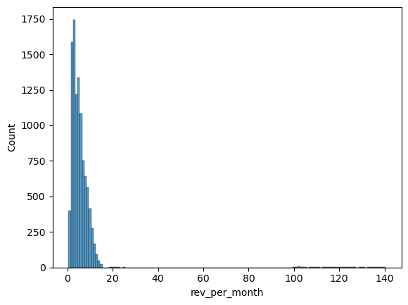
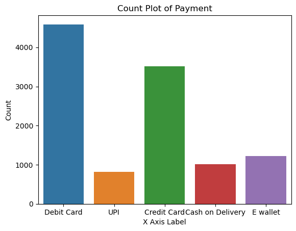
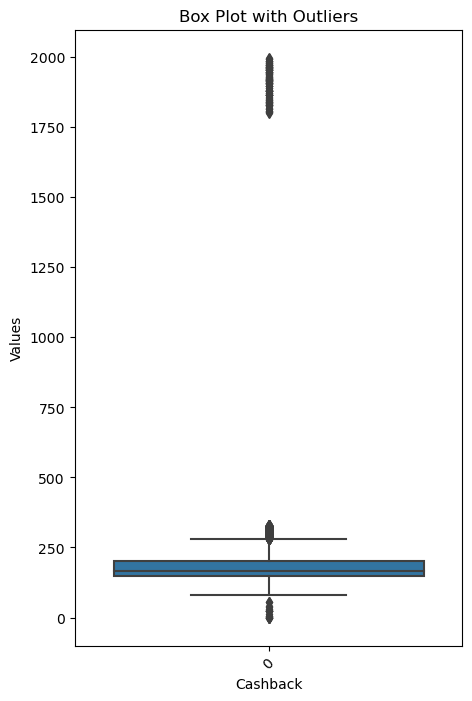

# Customer Churn Prediction Model

### Problem Statement:
### An E Commerce company is facing a lot of competition in the current market and it has become a challenge to retain the existing customers in the current situation. Hence, the company wants to develop a model through which they can do churn prediction of the accounts and provide segmented offers to the potential churners. In this company, account churn is a major thing because 1 account can havemultiple customers. hence by losing one account the company might be losing more than onecustomer.
### You have been assigned to develop a churn prediction model for this company and provide business recommendations on the campaign. 

### Contents
### - Data Loading and Initial analysis
### - Exploratory Data Analysis (Univariate, Bivariate and Multivariate)
### - Data Cleaning
### - PCA, Clustering and Cluster Analysis
### - Model Building (KNN, Random Forest, SVM, ADABoost, XGBoost)
### - Model Tuning (Hyperparameter Tuning, Cross Validation Tuning and Oversampling with SMOTE)


```python
import numpy as np
import pandas as pd
import seaborn as sns
import matplotlib
from matplotlib import pyplot as plt
import warnings
warnings.filterwarnings('ignore')
```

### Let's start with loading data and exploring details of data.


```python
data = pd.read_excel('Customer_Churn_Data.xlsx', 1)
```


```python
data.head()
```


<div>
<style scoped>
    .dataframe tbody tr th:only-of-type {
        vertical-align: middle;
    }

    .dataframe tbody tr th {
        vertical-align: top;
    }

    .dataframe thead th {
        text-align: right;
    }
</style>
<table border="1" class="dataframe">
  <thead>
    <tr style="text-align: right;">
      <th></th>
      <th>AccountID</th>
      <th>Churn</th>
      <th>Tenure</th>
      <th>City_Tier</th>
      <th>CC_Contacted_LY</th>
      <th>Payment</th>
      <th>Gender</th>
      <th>Service_Score</th>
      <th>Account_user_count</th>
      <th>account_segment</th>
      <th>CC_Agent_Score</th>
      <th>Marital_Status</th>
      <th>rev_per_month</th>
      <th>Complain_ly</th>
      <th>rev_growth_yoy</th>
      <th>coupon_used_for_payment</th>
      <th>Day_Since_CC_connect</th>
      <th>cashback</th>
      <th>Login_device</th>
    </tr>
  </thead>
  <tbody>
    <tr>
      <th>0</th>
      <td>20000</td>
      <td>1</td>
      <td>4</td>
      <td>3.0</td>
      <td>6.0</td>
      <td>Debit Card</td>
      <td>Female</td>
      <td>3.0</td>
      <td>3</td>
      <td>Super</td>
      <td>2.0</td>
      <td>Single</td>
      <td>9</td>
      <td>1.0</td>
      <td>11</td>
      <td>1</td>
      <td>5</td>
      <td>159.93</td>
      <td>Mobile</td>
    </tr>
    <tr>
      <th>1</th>
      <td>20001</td>
      <td>1</td>
      <td>0</td>
      <td>1.0</td>
      <td>8.0</td>
      <td>UPI</td>
      <td>Male</td>
      <td>3.0</td>
      <td>4</td>
      <td>Regular Plus</td>
      <td>3.0</td>
      <td>Single</td>
      <td>7</td>
      <td>1.0</td>
      <td>15</td>
      <td>0</td>
      <td>0</td>
      <td>120.9</td>
      <td>Mobile</td>
    </tr>
    <tr>
      <th>2</th>
      <td>20002</td>
      <td>1</td>
      <td>0</td>
      <td>1.0</td>
      <td>30.0</td>
      <td>Debit Card</td>
      <td>Male</td>
      <td>2.0</td>
      <td>4</td>
      <td>Regular Plus</td>
      <td>3.0</td>
      <td>Single</td>
      <td>6</td>
      <td>1.0</td>
      <td>14</td>
      <td>0</td>
      <td>3</td>
      <td>NaN</td>
      <td>Mobile</td>
    </tr>
    <tr>
      <th>3</th>
      <td>20003</td>
      <td>1</td>
      <td>0</td>
      <td>3.0</td>
      <td>15.0</td>
      <td>Debit Card</td>
      <td>Male</td>
      <td>2.0</td>
      <td>4</td>
      <td>Super</td>
      <td>5.0</td>
      <td>Single</td>
      <td>8</td>
      <td>0.0</td>
      <td>23</td>
      <td>0</td>
      <td>3</td>
      <td>134.07</td>
      <td>Mobile</td>
    </tr>
    <tr>
      <th>4</th>
      <td>20004</td>
      <td>1</td>
      <td>0</td>
      <td>1.0</td>
      <td>12.0</td>
      <td>Credit Card</td>
      <td>Male</td>
      <td>2.0</td>
      <td>3</td>
      <td>Regular Plus</td>
      <td>5.0</td>
      <td>Single</td>
      <td>3</td>
      <td>0.0</td>
      <td>11</td>
      <td>1</td>
      <td>3</td>
      <td>129.6</td>
      <td>Mobile</td>
    </tr>
  </tbody>
</table>
</div>


```python
data.shape
```


    (11260, 19)


```python
data.describe()
```


<div>
<style scoped>
    .dataframe tbody tr th:only-of-type {
        vertical-align: middle;
    }

    .dataframe tbody tr th {
        vertical-align: top;
    }

    .dataframe thead th {
        text-align: right;
    }
</style>
<table border="1" class="dataframe">
  <thead>
    <tr style="text-align: right;">
      <th></th>
      <th>AccountID</th>
      <th>Churn</th>
      <th>City_Tier</th>
      <th>CC_Contacted_LY</th>
      <th>Service_Score</th>
      <th>CC_Agent_Score</th>
      <th>Complain_ly</th>
    </tr>
  </thead>
  <tbody>
    <tr>
      <th>count</th>
      <td>11260.00000</td>
      <td>11260.000000</td>
      <td>11148.000000</td>
      <td>11158.000000</td>
      <td>11162.000000</td>
      <td>11144.000000</td>
      <td>10903.000000</td>
    </tr>
    <tr>
      <th>mean</th>
      <td>25629.50000</td>
      <td>0.168384</td>
      <td>1.653929</td>
      <td>17.867091</td>
      <td>2.902526</td>
      <td>3.066493</td>
      <td>0.285334</td>
    </tr>
    <tr>
      <th>std</th>
      <td>3250.62635</td>
      <td>0.374223</td>
      <td>0.915015</td>
      <td>8.853269</td>
      <td>0.725584</td>
      <td>1.379772</td>
      <td>0.451594</td>
    </tr>
    <tr>
      <th>min</th>
      <td>20000.00000</td>
      <td>0.000000</td>
      <td>1.000000</td>
      <td>4.000000</td>
      <td>0.000000</td>
      <td>1.000000</td>
      <td>0.000000</td>
    </tr>
    <tr>
      <th>25%</th>
      <td>22814.75000</td>
      <td>0.000000</td>
      <td>1.000000</td>
      <td>11.000000</td>
      <td>2.000000</td>
      <td>2.000000</td>
      <td>0.000000</td>
    </tr>
    <tr>
      <th>50%</th>
      <td>25629.50000</td>
      <td>0.000000</td>
      <td>1.000000</td>
      <td>16.000000</td>
      <td>3.000000</td>
      <td>3.000000</td>
      <td>0.000000</td>
    </tr>
    <tr>
      <th>75%</th>
      <td>28444.25000</td>
      <td>0.000000</td>
      <td>3.000000</td>
      <td>23.000000</td>
      <td>3.000000</td>
      <td>4.000000</td>
      <td>1.000000</td>
    </tr>
    <tr>
      <th>max</th>
      <td>31259.00000</td>
      <td>1.000000</td>
      <td>3.000000</td>
      <td>132.000000</td>
      <td>5.000000</td>
      <td>5.000000</td>
      <td>1.000000</td>
    </tr>
  </tbody>
</table>
</div>


```python
# Data types and count of records.
data.info()
```

    <class 'pandas.core.frame.DataFrame'>
    RangeIndex: 11260 entries, 0 to 11259
    Data columns (total 19 columns):
     #   Column                   Non-Null Count  Dtype  
    ---  ------                   --------------  -----  
     0   AccountID                11260 non-null  int64  
     1   Churn                    11260 non-null  int64  
     2   Tenure                   11158 non-null  object 
     3   City_Tier                11148 non-null  float64
     4   CC_Contacted_LY          11158 non-null  float64
     5   Payment                  11151 non-null  object 
     6   Gender                   11152 non-null  object 
     7   Service_Score            11162 non-null  float64
     8   Account_user_count       11148 non-null  object 
     9   account_segment          11163 non-null  object 
     10  CC_Agent_Score           11144 non-null  float64
     11  Marital_Status           11048 non-null  object 
     12  rev_per_month            11158 non-null  object 
     13  Complain_ly              10903 non-null  float64
     14  rev_growth_yoy           11260 non-null  object 
     15  coupon_used_for_payment  11260 non-null  object 
     16  Day_Since_CC_connect     10903 non-null  object 
     17  cashback                 10789 non-null  object 
     18  Login_device             11039 non-null  object 
    dtypes: float64(5), int64(2), object(12)
    memory usage: 1.6+ MB


```python
#Count of Null Values
data.isnull().sum()
```


    AccountID                    0
    Churn                        0
    Tenure                     102
    City_Tier                  112
    CC_Contacted_LY            102
    Payment                    109
    Gender                     108
    Service_Score               98
    Account_user_count         112
    account_segment             97
    CC_Agent_Score             116
    Marital_Status             212
    rev_per_month              102
    Complain_ly                357
    rev_growth_yoy               0
    coupon_used_for_payment      0
    Day_Since_CC_connect       357
    cashback                   471
    Login_device               221
    dtype: int64


```python
data_na = data.isna().sum()
missing_percentage = (data_na / len(data)) * 100
missing_info = pd.DataFrame({'Missing Count': data_na, 'Missing Percentage': missing_percentage})
missing_info = missing_info[missing_info['Missing Count'] > 0].sort_values(by='Missing Percentage', ascending=False)

print(missing_info)
```

                          Missing Count  Missing Percentage
    cashback                        471            4.182948
    Complain_ly                     357            3.170515
    Day_Since_CC_connect            357            3.170515
    Login_device                    221            1.962700
    Marital_Status                  212            1.882771
    CC_Agent_Score                  116            1.030195
    City_Tier                       112            0.994671
    Account_user_count              112            0.994671
    Payment                         109            0.968028
    Gender                          108            0.959147
    Tenure                          102            0.905861
    CC_Contacted_LY                 102            0.905861
    rev_per_month                   102            0.905861
    Service_Score                    98            0.870337
    account_segment                  97            0.861456


```python
#Target Variable
data.Churn.unique()
```


    array([1, 0])


```python
import re


# List of special characters that you want to replace
special_characters = ['$','#','*','&&&&','@','+']

# Escape the special characters for regex
escaped_special_characters = [re.escape(char) for char in special_characters]

# Create a regex pattern to match any of the escaped special characters
pattern = '|'.join(escaped_special_characters)

# Iterate through each column
for column in data.columns:
    # Replace special characters with NaN
    data[column] = data[column].replace(pattern, pd.NA, regex=True)
```


```python
data.coupon_used_for_payment.unique()
```


    array([1, 0, 4, 2, 9, 6, 11, 7, 12, 10, 5, 3, 13, 15, 8, <NA>, 14, 16],
          dtype=object)


```python
# Let's have a look at unique values in it variable 
for column in data.columns:
    unique_values = data[column].unique()
    print(f"Unique values in {column}:", unique_values)
```

    Unique values in AccountID: [20000 20001 20002 ... 31257 31258 31259]
    Unique values in Churn: [1 0]
    Unique values in Tenure: [4 0 2 13 11 <NA> 9 99 19 20 14 8 26 18 5 30 7 1 23 3 29 6 28 24 25 16 10
     15 22 nan 27 12 21 17 50 60 31 51 61]
    Unique values in City_Tier: [ 3.  1. nan  2.]
    Unique values in CC_Contacted_LY: [  6.   8.  30.  15.  12.  22.  11.   9.  31.  18.  13.  20.  29.  28.
      26.  14.  10.  25.  27.  17.  23.  33.  19.  35.  24.  16.  32.  21.
      nan  34.   5.   4. 126.   7.  36. 127.  42.  38.  37.  39.  40.  41.
     132.  43. 129.]
    Unique values in Payment: ['Debit Card' 'UPI' 'Credit Card' 'Cash on Delivery' 'E wallet' nan]
    Unique values in Gender: ['Female' 'Male' 'F' nan 'M']
    Unique values in Service_Score: [ 3.  2.  1. nan  0.  4.  5.]
    Unique values in Account_user_count: [3 4 nan 5 2 <NA> 1 6]
    Unique values in account_segment: ['Super' 'Regular Plus' 'Regular' 'HNI' <NA> nan 'Super Plus']
    Unique values in CC_Agent_Score: [ 2.  3.  5.  4. nan  1.]
    Unique values in Marital_Status: ['Single' 'Divorced' 'Married' nan]
    Unique values in rev_per_month: [9 7 6 8 3 2 4 10 1 5 <NA> 130 nan 19 139 102 120 138 127 123 124 116 21
     126 134 113 114 108 140 133 129 107 118 11 105 20 119 121 137 110 22 101
     136 125 14 13 12 115 23 122 117 131 104 15 25 135 111 109 100 103]
    Unique values in Complain_ly: [ 1.  0. nan]
    Unique values in rev_growth_yoy: [11 15 14 23 22 16 12 13 17 18 24 19 20 21 25 26 <NA> 4 27 28]
    Unique values in coupon_used_for_payment: [1 0 4 2 9 6 11 7 12 10 5 3 13 15 8 <NA> 14 16]
    Unique values in Day_Since_CC_connect: [5 0 3 7 2 1 8 6 4 15 nan 11 10 9 13 12 17 16 14 30 <NA> 46 18 31 47]
    Unique values in cashback: [159.93 120.9 nan ... 227.36 226.91 191.42]
    Unique values in Login_device: ['Mobile' 'Computer' <NA> nan]


```python
data_na = data.isna().sum()
missing_percentage = (data_na / len(data)) * 100
missing_info = pd.DataFrame({'Missing Count': data_na, 'Missing Percentage': missing_percentage})
missing_info = missing_info[missing_info['Missing Count'] > 0].sort_values(by='Missing Percentage', ascending=False)

print(missing_info)
```

                             Missing Count  Missing Percentage
    rev_per_month                      791            7.024867
    Login_device                       760            6.749556
    cashback                           473            4.200710
    Account_user_count                 444            3.943162
    account_segment                    406            3.605684
    Day_Since_CC_connect               358            3.179396
    Complain_ly                        357            3.170515
    Tenure                             218            1.936057
    Marital_Status                     212            1.882771
    CC_Agent_Score                     116            1.030195
    City_Tier                          112            0.994671
    Payment                            109            0.968028
    Gender                             108            0.959147
    CC_Contacted_LY                    102            0.905861
    Service_Score                       98            0.870337
    rev_growth_yoy                       3            0.026643
    coupon_used_for_payment              3            0.026643


## Exploratory Data Analysis

### Let's have a look at distribution of numerical variables


```python
sns.histplot(data['Tenure'])
```


    <Axes: xlabel='Tenure', ylabel='Count'>


    

    


```python
sns.histplot(data['CC_Contacted_LY'])
```


    <Axes: xlabel='CC_Contacted_LY', ylabel='Count'>


    

    


```python
sns.histplot(data['rev_per_month'])
```


    <Axes: xlabel='rev_per_month', ylabel='Count'>


    

    


```python
sns.histplot(data['rev_growth_yoy'])
```


    <Axes: xlabel='rev_growth_yoy', ylabel='Count'>


    

    


```python
sns.histplot(data['coupon_used_for_payment'])
```


    <Axes: xlabel='coupon_used_for_payment', ylabel='Count'>


    

    


```python
sns.histplot(data['Day_Since_CC_connect'])
```


    <Axes: xlabel='Day_Since_CC_connect', ylabel='Count'>


    

    


```python
sns.histplot(data['cashback'])
```


    <Axes: xlabel='cashback', ylabel='Count'>


    

    


### Next let's explore categorical variables in data.


```python
# List of variables to plot
variables_to_plot = ['Churn', 'City_Tier', 'Payment', 'Gender', 'Service_Score', 'Account_user_count', 'account_segment', 'CC_Agent_Score', 'Marital_Status', 'Complain_ly', 'Login_device' ]  # Replace with the variables you want to plot

for variable in variables_to_plot:
    sns.countplot(x=variable, data=data)
    plt.title(f'Count Plot of {variable}')
    plt.xlabel('X Axis Label')  
    plt.ylabel('Count')  
    plt.show()
```


    

    


    

    


    

    


    

    


    

    


    

    


    

    


    

    


    

    


    

    


    

    


## Data Cleaning


```python
# Replace "M" with "Male" and "F" with "Female" in the gender column
data['Gender'] = data['Gender'].replace({'M': 'Male', 'F': 'Female'})
```


```python
# Convert columns to appropriate data types
categorical_columns = ['Churn','Login_device', 'account_segment', 'Marital_Status', 'Payment', 'Gender', 'Complain_ly', 'CC_Agent_Score', 'City_Tier', 'Service_Score' ]
numerical_columns = ['cashback', 'coupon_used_for_payment', 'rev_per_month', 'Account_user_count', 'Day_Since_CC_connect', 'Tenure', 'CC_Contacted_LY', 'rev_growth_yoy']

for col in categorical_columns:
    data[col] = data[col].astype('category')

for col in numerical_columns:
    data[col] = pd.to_numeric(data[col], errors='coerce')  # 'coerce' will turn invalid parsing into NaN
```


```python
data.info()
```

    <class 'pandas.core.frame.DataFrame'>
    RangeIndex: 11260 entries, 0 to 11259
    Data columns (total 19 columns):
     #   Column                   Non-Null Count  Dtype   
    ---  ------                   --------------  -----   
     0   AccountID                11260 non-null  int64   
     1   Churn                    11260 non-null  category
     2   Tenure                   11042 non-null  float64 
     3   City_Tier                11148 non-null  category
     4   CC_Contacted_LY          11158 non-null  float64 
     5   Payment                  11151 non-null  category
     6   Gender                   11152 non-null  category
     7   Service_Score            11162 non-null  category
     8   Account_user_count       10816 non-null  float64 
     9   account_segment          10854 non-null  category
     10  CC_Agent_Score           11144 non-null  category
     11  Marital_Status           11048 non-null  category
     12  rev_per_month            10469 non-null  float64 
     13  Complain_ly              10903 non-null  category
     14  rev_growth_yoy           11257 non-null  float64 
     15  coupon_used_for_payment  11257 non-null  float64 
     16  Day_Since_CC_connect     10902 non-null  float64 
     17  cashback                 10787 non-null  float64 
     18  Login_device             10500 non-null  category
    dtypes: category(10), float64(8), int64(1)
    memory usage: 903.4 KB


```python
# Drop two specific columns
columns_to_drop = ['AccountID', 'cashback']  
data_box = data.drop(columns=columns_to_drop)

# Create a box plot to visualize outliers
plt.figure(figsize=(10, 6))
sns.boxplot(data=data_box)
plt.title('Box Plot with Outliers')
plt.xlabel('Features')
plt.ylabel('Values')
plt.xticks(rotation=45)
plt.show()
```


    

    


```python
# Create a box plot to visualize outliers
plt.figure(figsize=(5, 8))
sns.boxplot(data=data["cashback"])
plt.title('Box Plot with Outliers')
plt.xlabel('Cashback')
plt.ylabel('Values')
plt.xticks(rotation=45)
plt.show()
```


    

    


```python
# Exclude the 'AccountID' column from the selection
columns_to_cap = data.select_dtypes(include=['float64', 'int64']).columns.difference(['AccountID'])

# Create a DataFrame with selected columns containing outliers
data_box = data[columns_to_cap]

# Convert columns to numeric type
data_box = data_box.apply(pd.to_numeric, errors='coerce')

# Define the capping/flooring method (upper and lower limits)
def cap_outliers(column):
    Q1 = column.quantile(0.25)
    Q3 = column.quantile(0.75)
    IQR = Q3 - Q1
    lower_limit = Q1 - 1.5 * IQR
    upper_limit = Q3 + 1.5 * IQR
    return column.apply(lambda x: lower_limit if x < lower_limit else upper_limit if x > upper_limit else x)

# Apply the method to each column in the data_box DataFrame
for col in data_box.columns:
    data_box[col] = cap_outliers(data_box[col])
```


```python
# Create a box plot to visualize outliers
plt.figure(figsize=(10, 6))
sns.boxplot(data=data_box)
plt.title('Box Plot without Outliers')
plt.xlabel('Features')
plt.ylabel('Values')
plt.xticks(rotation=45)
plt.show()
```


    

    


```python
# Merge the capped columns back into the original dataset
data.update(data_box)
```


```python
data["Churn"].value_counts()
```


    0    9364
    1    1896
    Name: Churn, dtype: int64


```python
# Convert columns to appropriate data types
categorical_columns = ['Churn','Login_device', 'account_segment', 'Marital_Status', 'Payment', 'Gender', 'Complain_ly', 'CC_Agent_Score', 'City_Tier', 'Service_Score' ]
numerical_columns = ['cashback', 'coupon_used_for_payment', 'rev_per_month', 'Account_user_count', 'Day_Since_CC_connect', 'Tenure', 'CC_Contacted_LY', 'rev_growth_yoy']

```


```python
# Treating numerical missing values
from sklearn.impute import KNNImputer


# Create a DataFrame with the specified numeric columns
data_numeric = data[numerical_columns]

# Initialize the KNNImputer with the desired number of neighbors (k)
knn_imputer = KNNImputer(n_neighbors=5)  

# Perform K-nearest neighbor imputation on the numeric columns
data_numeric_imputed = knn_imputer.fit_transform(data_numeric)

# Convert the imputed array back to a DataFrame
data_numeric_imputed = pd.DataFrame(data_numeric_imputed, columns=numerical_columns, index=data_numeric.index)
```


```python
# Merge the imputed numeric columns back into the original dataset
data.update(data_numeric_imputed)
```


```python
data.isnull().sum()
```


    AccountID                    0
    Churn                        0
    Tenure                       0
    City_Tier                  112
    CC_Contacted_LY              0
    Payment                    109
    Gender                     108
    Service_Score               98
    Account_user_count           0
    account_segment            406
    CC_Agent_Score             116
    Marital_Status             212
    rev_per_month                0
    Complain_ly                357
    rev_growth_yoy               0
    coupon_used_for_payment      0
    Day_Since_CC_connect         0
    cashback                     0
    Login_device               760
    dtype: int64


```python
# We will impute categorical missing values by replacing Mode of variable. 
data_imputed = data.copy()
for column in categorical_columns:
 mode_value = data[column].mode()[0]
 data_imputed[column].fillna(mode_value, inplace=True)
```


```python
 data_imputed.info()
```

    <class 'pandas.core.frame.DataFrame'>
    RangeIndex: 11260 entries, 0 to 11259
    Data columns (total 19 columns):
     #   Column                   Non-Null Count  Dtype   
    ---  ------                   --------------  -----   
     0   AccountID                11260 non-null  int64   
     1   Churn                    11260 non-null  category
     2   Tenure                   11260 non-null  float64 
     3   City_Tier                11260 non-null  category
     4   CC_Contacted_LY          11260 non-null  float64 
     5   Payment                  11260 non-null  category
     6   Gender                   11260 non-null  category
     7   Service_Score            11260 non-null  category
     8   Account_user_count       11260 non-null  float64 
     9   account_segment          11260 non-null  category
     10  CC_Agent_Score           11260 non-null  category
     11  Marital_Status           11260 non-null  category
     12  rev_per_month            11260 non-null  float64 
     13  Complain_ly              11260 non-null  category
     14  rev_growth_yoy           11260 non-null  float64 
     15  coupon_used_for_payment  11260 non-null  float64 
     16  Day_Since_CC_connect     11260 non-null  float64 
     17  cashback                 11260 non-null  float64 
     18  Login_device             11260 non-null  category
    dtypes: category(10), float64(8), int64(1)
    memory usage: 903.4 KB


### Now let's have a look at corelation among the numerical variables.


```python
# List of numeric columns
numerical_columns = ['cashback', 'coupon_used_for_payment', 'rev_per_month', 'Account_user_count', 'Day_Since_CC_connect', 'Tenure', 'CC_Contacted_LY', 'rev_growth_yoy']

# Select only the numeric columns from the DataFrame
numeric_df = data_imputed[numerical_columns]

# Create a pair plot using Seaborn
sns.pairplot(numeric_df)
plt.figure(figsize=(10, 6))
plt.show()
```


    

    


    <Figure size 1000x600 with 0 Axes>


```python
# List of numeric columns
numerical_columns = ['cashback', 'coupon_used_for_payment', 'rev_per_month', 'Account_user_count', 'Day_Since_CC_connect', 'Tenure', 'CC_Contacted_LY', 'rev_growth_yoy']

# Calculate the correlation matrix
correlation_matrix =  data_imputed[numerical_columns].corr()

# Create a heatmap using Seaborn
plt.figure(figsize=(10, 6))
sns.heatmap(correlation_matrix, annot=True, cmap='coolwarm', center=0)
plt.title('Correlation Heatmap')
plt.show()
```


    

    


### Lets have a look at distribution of target variable using scatterplot


```python
# Choose the two variables for the scatter plot
x_variable = 'cashback'
y_variable = 'Tenure'

# Create a scatter plot using Seaborn
plt.figure(figsize=(8, 6))
sns.scatterplot(data=data_imputed, x=x_variable, y=y_variable, hue='Churn')
plt.title(f'Scatter Plot of {x_variable} vs {y_variable}')
plt.xlabel(x_variable)
plt.ylabel(y_variable)
plt.show()
```


    

    


```python
# Choose the two variables for the scatter plot
x_variable = 'coupon_used_for_payment'
y_variable = 'Day_Since_CC_connect'

# Create a scatter plot using Seaborn
plt.figure(figsize=(8, 6))
sns.scatterplot(data=data_imputed, x=x_variable, y=y_variable, hue='Churn')
plt.title(f'Scatter Plot of {x_variable} vs {y_variable}')
plt.xlabel(x_variable)
plt.ylabel(y_variable)
plt.show()
```


    

    


### Lets run Chi-square test to know the dependency among categorical variables


```python
from scipy.stats import chi2_contingency
import pandas as pd

# Assuming 'data_imputed' is your DataFrame and you have defined 'categorical_columns'
categorical_columns = ['Churn','Login_device', 'account_segment', 'Marital_Status', 'Payment', 'Gender', 'Complain_ly', 'CC_Agent_Score', 'City_Tier', 'Service_Score' ]

# Create empty DataFrames to store results
chi_square_statistic_results = pd.DataFrame(index=categorical_columns, columns=categorical_columns)
p_value_results = pd.DataFrame(index=categorical_columns, columns=categorical_columns)

# Iterate over pairs of columns
for col1 in categorical_columns:
    for col2 in categorical_columns:
        # Create contingency table
        contingency_table = pd.crosstab(data_imputed[col1], data_imputed[col2])
        
        # Perform chi-square test
        chi2, p, dof, expected = chi2_contingency(contingency_table)
        
        # Store chi-square statistic and p-value in respective DataFrames
        chi_square_statistic_results.loc[col1, col2] = chi2
        p_value_results.loc[col1, col2] = p

# Display results
print("Chi-square statistic results:")
display(chi_square_statistic_results)

print("\n")

print("P-value results:")
display(p_value_results)
```

    Chi-square statistic results:


<div>
<style scoped>
    .dataframe tbody tr th:only-of-type {
        vertical-align: middle;
    }

    .dataframe tbody tr th {
        vertical-align: top;
    }

    .dataframe thead th {
        text-align: right;
    }
</style>
<table border="1" class="dataframe">
  <thead>
    <tr style="text-align: right;">
      <th></th>
      <th>Churn</th>
      <th>Login_device</th>
      <th>account_segment</th>
      <th>Marital_Status</th>
      <th>Payment</th>
      <th>Gender</th>
      <th>Complain_ly</th>
      <th>CC_Agent_Score</th>
      <th>City_Tier</th>
      <th>Service_Score</th>
    </tr>
  </thead>
  <tbody>
    <tr>
      <th>Churn</th>
      <td>11252.859836</td>
      <td>25.215245</td>
      <td>519.937473</td>
      <td>378.97537</td>
      <td>102.708097</td>
      <td>9.385975</td>
      <td>681.879193</td>
      <td>139.007042</td>
      <td>80.542597</td>
      <td>18.401197</td>
    </tr>
    <tr>
      <th>Login_device</th>
      <td>25.215245</td>
      <td>11254.903456</td>
      <td>27.414329</td>
      <td>13.150997</td>
      <td>14.328582</td>
      <td>1.559184</td>
      <td>0.344538</td>
      <td>30.456042</td>
      <td>0.649746</td>
      <td>10.209065</td>
    </tr>
    <tr>
      <th>account_segment</th>
      <td>519.937473</td>
      <td>27.414329</td>
      <td>45040.0</td>
      <td>104.220906</td>
      <td>430.841325</td>
      <td>57.79624</td>
      <td>22.667228</td>
      <td>43.60607</td>
      <td>950.905828</td>
      <td>36.653222</td>
    </tr>
    <tr>
      <th>Marital_Status</th>
      <td>378.97537</td>
      <td>13.150997</td>
      <td>104.220906</td>
      <td>22520.0</td>
      <td>30.17713</td>
      <td>18.205669</td>
      <td>0.238228</td>
      <td>1243.851818</td>
      <td>46.601926</td>
      <td>32.769268</td>
    </tr>
    <tr>
      <th>Payment</th>
      <td>102.708097</td>
      <td>14.328582</td>
      <td>430.841325</td>
      <td>30.17713</td>
      <td>45040.0</td>
      <td>28.147084</td>
      <td>6.943521</td>
      <td>117.392339</td>
      <td>4225.867383</td>
      <td>20.226023</td>
    </tr>
    <tr>
      <th>Gender</th>
      <td>9.385975</td>
      <td>1.559184</td>
      <td>57.79624</td>
      <td>18.205669</td>
      <td>28.147084</td>
      <td>11255.815949</td>
      <td>14.252895</td>
      <td>19.007916</td>
      <td>27.394536</td>
      <td>11.535759</td>
    </tr>
    <tr>
      <th>Complain_ly</th>
      <td>681.879193</td>
      <td>0.344538</td>
      <td>22.667228</td>
      <td>0.238228</td>
      <td>6.943521</td>
      <td>14.252895</td>
      <td>11254.999376</td>
      <td>32.367112</td>
      <td>3.579055</td>
      <td>3.850417</td>
    </tr>
    <tr>
      <th>CC_Agent_Score</th>
      <td>139.007042</td>
      <td>30.456042</td>
      <td>43.60607</td>
      <td>1243.851818</td>
      <td>117.392339</td>
      <td>19.007916</td>
      <td>32.367112</td>
      <td>45040.0</td>
      <td>86.046319</td>
      <td>27.071374</td>
    </tr>
    <tr>
      <th>City_Tier</th>
      <td>80.542597</td>
      <td>0.649746</td>
      <td>950.905828</td>
      <td>46.601926</td>
      <td>4225.867383</td>
      <td>27.394536</td>
      <td>3.579055</td>
      <td>86.046319</td>
      <td>22520.0</td>
      <td>17.646964</td>
    </tr>
    <tr>
      <th>Service_Score</th>
      <td>18.401197</td>
      <td>10.209065</td>
      <td>36.653222</td>
      <td>32.769268</td>
      <td>20.226023</td>
      <td>11.535759</td>
      <td>3.850417</td>
      <td>27.071374</td>
      <td>17.646964</td>
      <td>56300.0</td>
    </tr>
  </tbody>
</table>
</div>


    
    
    P-value results:


<div>
<style scoped>
    .dataframe tbody tr th:only-of-type {
        vertical-align: middle;
    }

    .dataframe tbody tr th {
        vertical-align: top;
    }

    .dataframe thead th {
        text-align: right;
    }
</style>
<table border="1" class="dataframe">
  <thead>
    <tr style="text-align: right;">
      <th></th>
      <th>Churn</th>
      <th>Login_device</th>
      <th>account_segment</th>
      <th>Marital_Status</th>
      <th>Payment</th>
      <th>Gender</th>
      <th>Complain_ly</th>
      <th>CC_Agent_Score</th>
      <th>City_Tier</th>
      <th>Service_Score</th>
    </tr>
  </thead>
  <tbody>
    <tr>
      <th>Churn</th>
      <td>0.0</td>
      <td>0.000001</td>
      <td>0.0</td>
      <td>0.0</td>
      <td>0.0</td>
      <td>0.002187</td>
      <td>0.0</td>
      <td>0.0</td>
      <td>0.0</td>
      <td>0.002483</td>
    </tr>
    <tr>
      <th>Login_device</th>
      <td>0.000001</td>
      <td>0.0</td>
      <td>0.000016</td>
      <td>0.001394</td>
      <td>0.006317</td>
      <td>0.211785</td>
      <td>0.557222</td>
      <td>0.000004</td>
      <td>0.722619</td>
      <td>0.069524</td>
    </tr>
    <tr>
      <th>account_segment</th>
      <td>0.0</td>
      <td>0.000016</td>
      <td>0.0</td>
      <td>0.0</td>
      <td>0.0</td>
      <td>0.0</td>
      <td>0.000148</td>
      <td>0.000226</td>
      <td>0.0</td>
      <td>0.012874</td>
    </tr>
    <tr>
      <th>Marital_Status</th>
      <td>0.0</td>
      <td>0.001394</td>
      <td>0.0</td>
      <td>0.0</td>
      <td>0.000197</td>
      <td>0.000111</td>
      <td>0.887707</td>
      <td>0.0</td>
      <td>0.0</td>
      <td>0.000298</td>
    </tr>
    <tr>
      <th>Payment</th>
      <td>0.0</td>
      <td>0.006317</td>
      <td>0.0</td>
      <td>0.000197</td>
      <td>0.0</td>
      <td>0.000012</td>
      <td>0.138903</td>
      <td>0.0</td>
      <td>0.0</td>
      <td>0.443873</td>
    </tr>
    <tr>
      <th>Gender</th>
      <td>0.002187</td>
      <td>0.211785</td>
      <td>0.0</td>
      <td>0.000111</td>
      <td>0.000012</td>
      <td>0.0</td>
      <td>0.00016</td>
      <td>0.000783</td>
      <td>0.000001</td>
      <td>0.041733</td>
    </tr>
    <tr>
      <th>Complain_ly</th>
      <td>0.0</td>
      <td>0.557222</td>
      <td>0.000148</td>
      <td>0.887707</td>
      <td>0.138903</td>
      <td>0.00016</td>
      <td>0.0</td>
      <td>0.000002</td>
      <td>0.167039</td>
      <td>0.571147</td>
    </tr>
    <tr>
      <th>CC_Agent_Score</th>
      <td>0.0</td>
      <td>0.000004</td>
      <td>0.000226</td>
      <td>0.0</td>
      <td>0.0</td>
      <td>0.000783</td>
      <td>0.000002</td>
      <td>0.0</td>
      <td>0.0</td>
      <td>0.133268</td>
    </tr>
    <tr>
      <th>City_Tier</th>
      <td>0.0</td>
      <td>0.722619</td>
      <td>0.0</td>
      <td>0.0</td>
      <td>0.0</td>
      <td>0.000001</td>
      <td>0.167039</td>
      <td>0.0</td>
      <td>0.0</td>
      <td>0.061219</td>
    </tr>
    <tr>
      <th>Service_Score</th>
      <td>0.002483</td>
      <td>0.069524</td>
      <td>0.012874</td>
      <td>0.000298</td>
      <td>0.443873</td>
      <td>0.041733</td>
      <td>0.571147</td>
      <td>0.133268</td>
      <td>0.061219</td>
      <td>0.0</td>
    </tr>
  </tbody>
</table>
</div>


```python
# Calculate and add new column
data_imputed['avg_cashback_per_user'] = data_imputed['cashback'] / data_imputed['Account_user_count']
```


```python
data_imputed["avg_cashback_per_user"].info()
```

    <class 'pandas.core.series.Series'>
    RangeIndex: 11260 entries, 0 to 11259
    Series name: avg_cashback_per_user
    Non-Null Count  Dtype  
    --------------  -----  
    11260 non-null  float64
    dtypes: float64(1)
    memory usage: 88.1 KB


```python
# Create a histogram
plt.figure(figsize=(8, 6))  # Optional: Set the figure size
plt.hist(data_imputed["avg_cashback_per_user"], bins=10, edgecolor='blue')  # Adjust the number of bins as needed

# Add labels and title
plt.xlabel('Average Cashback')
plt.ylabel('Frequecy')
plt.title('Histogram of a Average cashback per user')

# Show the plot
plt.show()
```


    

    


### We can see significant corelation or dependency in some variables, Hence lets run PCA to reduce the dimentiality of data.


```python
from sklearn.preprocessing import StandardScaler, LabelEncoder
from sklearn.cluster import KMeans
from sklearn.decomposition import PCA
import matplotlib.pyplot as plt
import seaborn as sns
%matplotlib inline
```


```python
# Convert columns to appropriate data types
categorical_columns = ['Churn','Login_device', 'account_segment', 'Marital_Status', 'Payment', 'Gender', 'Complain_ly', 'CC_Agent_Score', 'City_Tier', 'Service_Score' ]
numerical_columns = ['cashback', 'coupon_used_for_payment', 'rev_per_month', 'Account_user_count', 'Day_Since_CC_connect', 'Tenure', 'CC_Contacted_LY', 'rev_growth_yoy']


# Select relevant columns
selected_columns = categorical_columns + numerical_columns
data_selected = data_imputed[selected_columns]


# Encode categorical variables
label_encoder = LabelEncoder()
for col in categorical_columns:
    data_selected[col] = label_encoder.fit_transform(data_selected[col])

# Standardize numerical variables
scaler = StandardScaler()
data_scaled = scaler.fit_transform(data_selected)
```


```python
pca = PCA()
pca.fit(data_scaled)
explained_variance_ratio = pca.explained_variance_ratio_
cumulative_variance_ratio = np.cumsum(explained_variance_ratio)

plt.plot(range(1, len(cumulative_variance_ratio) + 1), cumulative_variance_ratio, marker='o')
plt.title('Cumulative Explained Variance')
plt.xlabel('Number of Components')
plt.ylabel('Cumulative Explained Variance Ratio')
plt.show()
```


    

    


```python
plt.plot(range(1, len(explained_variance_ratio) + 1), pca.explained_variance_, marker='o')
plt.title('Scree Plot')
plt.xlabel('Number of Components')
plt.ylabel('Eigenvalues')
plt.show()
```


    

    


### We can see Eigenvalues start to level off at 4


```python
# Apply PCA for dimensionality reduction
pca = PCA(n_components=6) 
data_pca = pca.fit_transform(data_scaled)
```


```python
wcss = []
for i in range(1, 11):
    kmeans = KMeans(n_clusters=i, init='k-means++', random_state=42)
    kmeans.fit(data_scaled)
    wcss.append(kmeans.inertia_)

plt.figure(figsize=(10, 6))
plt.plot(range(1, 11), wcss, marker='o')
plt.title('Elbow Method')
plt.xlabel('Number of Clusters')
plt.ylabel('WCSS')
plt.show()
```


    

    


### Lets now perform K-Mean Clustering to know the distinct clusters based on WCSS Plot. Here we will consider 3 Clusters.


```python
# Choose the optimal number of clusters
n_clusters = 3  

# Perform K-means clustering
kmeans = KMeans(n_clusters=n_clusters, init='k-means++', random_state=42)
clusters = kmeans.fit_predict(data_scaled)

# Add cluster labels to the original data
data_imputed['Cluster2'] = clusters
```


```python
data_imputed.head()
```


<div>
<style scoped>
    .dataframe tbody tr th:only-of-type {
        vertical-align: middle;
    }

    .dataframe tbody tr th {
        vertical-align: top;
    }

    .dataframe thead th {
        text-align: right;
    }
</style>
<table border="1" class="dataframe">
  <thead>
    <tr style="text-align: right;">
      <th></th>
      <th>AccountID</th>
      <th>Churn</th>
      <th>Tenure</th>
      <th>City_Tier</th>
      <th>CC_Contacted_LY</th>
      <th>Payment</th>
      <th>Gender</th>
      <th>Service_Score</th>
      <th>Account_user_count</th>
      <th>account_segment</th>
      <th>...</th>
      <th>Marital_Status</th>
      <th>rev_per_month</th>
      <th>Complain_ly</th>
      <th>rev_growth_yoy</th>
      <th>coupon_used_for_payment</th>
      <th>Day_Since_CC_connect</th>
      <th>cashback</th>
      <th>Login_device</th>
      <th>avg_cashback_per_user</th>
      <th>Cluster2</th>
    </tr>
  </thead>
  <tbody>
    <tr>
      <th>0</th>
      <td>20000</td>
      <td>1</td>
      <td>4.0</td>
      <td>3.0</td>
      <td>6.0</td>
      <td>Debit Card</td>
      <td>Female</td>
      <td>3.0</td>
      <td>3.0</td>
      <td>Super</td>
      <td>...</td>
      <td>Single</td>
      <td>9.0</td>
      <td>1.0</td>
      <td>11.0</td>
      <td>1.0</td>
      <td>5.0</td>
      <td>159.930</td>
      <td>Mobile</td>
      <td>53.3100</td>
      <td>1</td>
    </tr>
    <tr>
      <th>1</th>
      <td>20001</td>
      <td>1</td>
      <td>0.0</td>
      <td>1.0</td>
      <td>8.0</td>
      <td>UPI</td>
      <td>Male</td>
      <td>3.0</td>
      <td>4.0</td>
      <td>Regular Plus</td>
      <td>...</td>
      <td>Single</td>
      <td>7.0</td>
      <td>1.0</td>
      <td>15.0</td>
      <td>0.0</td>
      <td>0.0</td>
      <td>120.900</td>
      <td>Mobile</td>
      <td>30.2250</td>
      <td>1</td>
    </tr>
    <tr>
      <th>2</th>
      <td>20002</td>
      <td>1</td>
      <td>0.0</td>
      <td>1.0</td>
      <td>30.0</td>
      <td>Debit Card</td>
      <td>Male</td>
      <td>2.0</td>
      <td>4.0</td>
      <td>Regular Plus</td>
      <td>...</td>
      <td>Single</td>
      <td>6.0</td>
      <td>1.0</td>
      <td>14.0</td>
      <td>0.0</td>
      <td>3.0</td>
      <td>143.328</td>
      <td>Mobile</td>
      <td>35.8320</td>
      <td>1</td>
    </tr>
    <tr>
      <th>3</th>
      <td>20003</td>
      <td>1</td>
      <td>0.0</td>
      <td>3.0</td>
      <td>15.0</td>
      <td>Debit Card</td>
      <td>Male</td>
      <td>2.0</td>
      <td>4.0</td>
      <td>Super</td>
      <td>...</td>
      <td>Single</td>
      <td>8.0</td>
      <td>0.0</td>
      <td>23.0</td>
      <td>0.0</td>
      <td>3.0</td>
      <td>134.070</td>
      <td>Mobile</td>
      <td>33.5175</td>
      <td>1</td>
    </tr>
    <tr>
      <th>4</th>
      <td>20004</td>
      <td>1</td>
      <td>0.0</td>
      <td>1.0</td>
      <td>12.0</td>
      <td>Credit Card</td>
      <td>Male</td>
      <td>2.0</td>
      <td>3.0</td>
      <td>Regular Plus</td>
      <td>...</td>
      <td>Single</td>
      <td>3.0</td>
      <td>0.0</td>
      <td>11.0</td>
      <td>1.0</td>
      <td>3.0</td>
      <td>129.600</td>
      <td>Mobile</td>
      <td>43.2000</td>
      <td>1</td>
    </tr>
  </tbody>
</table>
<p>5 rows × 21 columns</p>
</div>


```python
plt.figure(figsize=(10, 6))
sns.scatterplot(x=data_pca[:, 0], y=data_pca[:, 1], hue=data_imputed['Cluster2'], palette='viridis')
plt.title('K-means Clustering')
plt.xlabel('Principal Component 1')
plt.ylabel('Principal Component 2')
plt.show()
```


    

    


```python
cluster_means = data_imputed.groupby('Cluster2').mean()
cluster_means = cluster_means.drop("AccountID", axis =1)
cluster_means
```


<div>
<style scoped>
    .dataframe tbody tr th:only-of-type {
        vertical-align: middle;
    }

    .dataframe tbody tr th {
        vertical-align: top;
    }

    .dataframe thead th {
        text-align: right;
    }
</style>
<table border="1" class="dataframe">
  <thead>
    <tr style="text-align: right;">
      <th></th>
      <th>Tenure</th>
      <th>CC_Contacted_LY</th>
      <th>Account_user_count</th>
      <th>rev_per_month</th>
      <th>rev_growth_yoy</th>
      <th>coupon_used_for_payment</th>
      <th>Day_Since_CC_connect</th>
      <th>cashback</th>
      <th>avg_cashback_per_user</th>
    </tr>
    <tr>
      <th>Cluster2</th>
      <th></th>
      <th></th>
      <th></th>
      <th></th>
      <th></th>
      <th></th>
      <th></th>
      <th></th>
      <th></th>
    </tr>
  </thead>
  <tbody>
    <tr>
      <th>0</th>
      <td>15.034785</td>
      <td>18.433977</td>
      <td>4.066450</td>
      <td>6.026346</td>
      <td>16.709605</td>
      <td>2.151773</td>
      <td>6.438824</td>
      <td>208.956859</td>
      <td>54.590972</td>
    </tr>
    <tr>
      <th>1</th>
      <td>3.006071</td>
      <td>19.405077</td>
      <td>3.891225</td>
      <td>5.468764</td>
      <td>16.128587</td>
      <td>1.360651</td>
      <td>3.134658</td>
      <td>159.637177</td>
      <td>43.858413</td>
    </tr>
    <tr>
      <th>2</th>
      <td>8.631090</td>
      <td>16.702764</td>
      <td>3.298117</td>
      <td>4.509936</td>
      <td>15.755449</td>
      <td>0.913682</td>
      <td>3.508614</td>
      <td>157.962016</td>
      <td>52.532416</td>
    </tr>
  </tbody>
</table>
</div>


```python
categorical_columns = ['Churn', 'Login_device', 'account_segment', 'Marital_Status', 'Payment', 'Gender', 'Complain_ly', 'CC_Agent_Score', 'City_Tier', 'Service_Score']

# Loop through each categorical column and calculate value counts within each cluster
cluster_value_counts = {}
for cat_col in categorical_columns:
    cluster_value_counts[cat_col] = data_imputed.groupby('Cluster2')[cat_col].value_counts()

# Print the value counts for each categorical column within each cluster
for cat_col, value_counts in cluster_value_counts.items():
    print(f"Value counts for '{cat_col}' within each cluster:")
    print(value_counts)
    print("\n")
```

    Value counts for 'Churn' within each cluster:
    Cluster2  Churn
    0         0        4373
              1          83
    1         1        1812
              0           0
    2         0        4991
              1           1
    Name: Churn, dtype: int64
    
    
    Value counts for 'Login_device' within each cluster:
    Cluster2  Login_device
    0         Mobile          3340
              Computer        1116
    1         Mobile          1222
              Computer         590
    2         Mobile          3680
              Computer        1312
    Name: Login_device, dtype: int64
    
    
    Value counts for 'account_segment' within each cluster:
    Cluster2  account_segment
    0         Super              1673
              HNI                1021
              Regular Plus        701
              Super Plus          594
              Regular             467
    1         Regular Plus       1054
              Super               489
              HNI                 225
              Super Plus           34
              Regular              10
    2         Super              2306
              Regular Plus       2107
              HNI                 393
              Super Plus          143
              Regular              43
    Name: account_segment, dtype: int64
    
    
    Value counts for 'Marital_Status' within each cluster:
    Cluster2  Marital_Status
    0         Married           2652
              Single            1027
              Divorced           777
    1         Single             928
              Married            665
              Divorced           219
    2         Married           2755
              Single            1565
              Divorced           672
    Name: Marital_Status, dtype: int64
    
    
    Value counts for 'Payment' within each cluster:
    Cluster2  Payment         
    0         Debit Card          1834
              Credit Card         1416
              E wallet             528
              Cash on Delivery     361
              UPI                  317
    1         Debit Card           705
              Credit Card          462
              E wallet             262
              Cash on Delivery     240
              UPI                  143
    2         Debit Card          2157
              Credit Card         1633
              E wallet             427
              Cash on Delivery     413
              UPI                  362
    Name: Payment, dtype: int64
    
    
    Value counts for 'Gender' within each cluster:
    Cluster2  Gender
    0         Male      2547
              Female    1909
    1         Male      1164
              Female     648
    2         Male      3101
              Female    1891
    Name: Gender, dtype: int64
    
    
    Value counts for 'Complain_ly' within each cluster:
    Cluster2  Complain_ly
    0         0.0            3405
              1.0            1051
    1         1.0             964
              0.0             848
    2         0.0            3896
              1.0            1096
    Name: Complain_ly, dtype: int64
    
    
    Value counts for 'CC_Agent_Score' within each cluster:
    Cluster2  CC_Agent_Score
    0         3.0               1344
              1.0                896
              4.0                887
              5.0                877
              2.0                452
    1         3.0                580
              5.0                504
              4.0                342
              1.0                249
              2.0                137
    2         3.0               1552
              1.0               1157
              4.0                898
              5.0                810
              2.0                575
    Name: CC_Agent_Score, dtype: int64
    
    
    Value counts for 'City_Tier' within each cluster:
    Cluster2  City_Tier
    0         1.0          2908
              3.0          1363
              2.0           185
    1         1.0          1021
              3.0           699
              2.0            92
    2         1.0          3446
              3.0          1343
              2.0           203
    Name: City_Tier, dtype: int64
    
    
    Value counts for 'Service_Score' within each cluster:
    Cluster2  Service_Score
    0         3.0              2307
              4.0              1636
              2.0               506
              5.0                 4
              1.0                 3
              0.0                 0
    1         3.0               914
              2.0               537
              4.0               361
              0.0                 0
              1.0                 0
              5.0                 0
    2         3.0              2367
              2.0              2208
              4.0               334
              1.0                74
              0.0                 8
              5.0                 1
    Name: Service_Score, dtype: int64
    
    


### Lets plot all variables across Clusters to perform Cluster Analysis


```python
import matplotlib.pyplot as plt
import seaborn as sns

# Loop through each categorical column and calculate value counts within each cluster
cluster_value_counts = {}
for cat_col in categorical_columns:
    cluster_value_counts[cat_col] = data_imputed.groupby('Cluster2')[cat_col].value_counts().reset_index(name='Count')

# Plot bar plots for each categorical column within each cluster
for cat_col, value_counts in cluster_value_counts.items():
    plt.figure(figsize=(10, 6))
    sns.barplot(x=cat_col, y='Count', hue='Cluster2', data=value_counts)
    plt.title(f"Bar Plot of '{cat_col}' within Clusters")
    plt.xlabel(cat_col)
    plt.ylabel('Value Counts')
    plt.xticks(rotation=45)
    plt.legend(title='Cluster')
    plt.tight_layout()
    plt.show()
```


    

    


    

    


    

    


    

    


    

    


    

    


    

    


    

    


    

    


    

    


## Model Building

### First we need prepare the data


```python
Data_ML = data_imputed.copy()
```


```python
Data_ML.info()
```

    <class 'pandas.core.frame.DataFrame'>
    RangeIndex: 11260 entries, 0 to 11259
    Data columns (total 21 columns):
     #   Column                   Non-Null Count  Dtype   
    ---  ------                   --------------  -----   
     0   AccountID                11260 non-null  int64   
     1   Churn                    11260 non-null  category
     2   Tenure                   11260 non-null  float64 
     3   City_Tier                11260 non-null  category
     4   CC_Contacted_LY          11260 non-null  float64 
     5   Payment                  11260 non-null  category
     6   Gender                   11260 non-null  category
     7   Service_Score            11260 non-null  category
     8   Account_user_count       11260 non-null  float64 
     9   account_segment          11260 non-null  category
     10  CC_Agent_Score           11260 non-null  category
     11  Marital_Status           11260 non-null  category
     12  rev_per_month            11260 non-null  float64 
     13  Complain_ly              11260 non-null  category
     14  rev_growth_yoy           11260 non-null  float64 
     15  coupon_used_for_payment  11260 non-null  float64 
     16  Day_Since_CC_connect     11260 non-null  float64 
     17  cashback                 11260 non-null  float64 
     18  Login_device             11260 non-null  category
     19  avg_cashback_per_user    11260 non-null  float64 
     20  Cluster2                 11260 non-null  int32   
    dtypes: category(10), float64(9), int32(1), int64(1)
    memory usage: 1.0 MB


```python
# List of categorical columns
categorical_columns = ['Churn', 'Login_device', 'account_segment', 'Marital_Status', 'Payment', 'Gender', 'Complain_ly', 'CC_Agent_Score', 'City_Tier', 'Service_Score']

# Create dummy variables for categorical variables
df = pd.get_dummies(Data_ML, columns=categorical_columns, drop_first=True)
```


```python
df.head()
```


<div>
<style scoped>
    .dataframe tbody tr th:only-of-type {
        vertical-align: middle;
    }

    .dataframe tbody tr th {
        vertical-align: top;
    }

    .dataframe thead th {
        text-align: right;
    }
</style>
<table border="1" class="dataframe">
  <thead>
    <tr style="text-align: right;">
      <th></th>
      <th>AccountID</th>
      <th>Tenure</th>
      <th>CC_Contacted_LY</th>
      <th>Account_user_count</th>
      <th>rev_per_month</th>
      <th>rev_growth_yoy</th>
      <th>coupon_used_for_payment</th>
      <th>Day_Since_CC_connect</th>
      <th>cashback</th>
      <th>avg_cashback_per_user</th>
      <th>...</th>
      <th>CC_Agent_Score_3.0</th>
      <th>CC_Agent_Score_4.0</th>
      <th>CC_Agent_Score_5.0</th>
      <th>City_Tier_2.0</th>
      <th>City_Tier_3.0</th>
      <th>Service_Score_1.0</th>
      <th>Service_Score_2.0</th>
      <th>Service_Score_3.0</th>
      <th>Service_Score_4.0</th>
      <th>Service_Score_5.0</th>
    </tr>
  </thead>
  <tbody>
    <tr>
      <th>0</th>
      <td>20000</td>
      <td>4.0</td>
      <td>6.0</td>
      <td>3.0</td>
      <td>9.0</td>
      <td>11.0</td>
      <td>1.0</td>
      <td>5.0</td>
      <td>159.930</td>
      <td>53.3100</td>
      <td>...</td>
      <td>0</td>
      <td>0</td>
      <td>0</td>
      <td>0</td>
      <td>1</td>
      <td>0</td>
      <td>0</td>
      <td>1</td>
      <td>0</td>
      <td>0</td>
    </tr>
    <tr>
      <th>1</th>
      <td>20001</td>
      <td>0.0</td>
      <td>8.0</td>
      <td>4.0</td>
      <td>7.0</td>
      <td>15.0</td>
      <td>0.0</td>
      <td>0.0</td>
      <td>120.900</td>
      <td>30.2250</td>
      <td>...</td>
      <td>1</td>
      <td>0</td>
      <td>0</td>
      <td>0</td>
      <td>0</td>
      <td>0</td>
      <td>0</td>
      <td>1</td>
      <td>0</td>
      <td>0</td>
    </tr>
    <tr>
      <th>2</th>
      <td>20002</td>
      <td>0.0</td>
      <td>30.0</td>
      <td>4.0</td>
      <td>6.0</td>
      <td>14.0</td>
      <td>0.0</td>
      <td>3.0</td>
      <td>143.328</td>
      <td>35.8320</td>
      <td>...</td>
      <td>1</td>
      <td>0</td>
      <td>0</td>
      <td>0</td>
      <td>0</td>
      <td>0</td>
      <td>1</td>
      <td>0</td>
      <td>0</td>
      <td>0</td>
    </tr>
    <tr>
      <th>3</th>
      <td>20003</td>
      <td>0.0</td>
      <td>15.0</td>
      <td>4.0</td>
      <td>8.0</td>
      <td>23.0</td>
      <td>0.0</td>
      <td>3.0</td>
      <td>134.070</td>
      <td>33.5175</td>
      <td>...</td>
      <td>0</td>
      <td>0</td>
      <td>1</td>
      <td>0</td>
      <td>1</td>
      <td>0</td>
      <td>1</td>
      <td>0</td>
      <td>0</td>
      <td>0</td>
    </tr>
    <tr>
      <th>4</th>
      <td>20004</td>
      <td>0.0</td>
      <td>12.0</td>
      <td>3.0</td>
      <td>3.0</td>
      <td>11.0</td>
      <td>1.0</td>
      <td>3.0</td>
      <td>129.600</td>
      <td>43.2000</td>
      <td>...</td>
      <td>0</td>
      <td>0</td>
      <td>1</td>
      <td>0</td>
      <td>0</td>
      <td>0</td>
      <td>1</td>
      <td>0</td>
      <td>0</td>
      <td>0</td>
    </tr>
  </tbody>
</table>
<p>5 rows × 36 columns</p>
</div>


```python
df.info()
```

    <class 'pandas.core.frame.DataFrame'>
    RangeIndex: 11260 entries, 0 to 11259
    Data columns (total 36 columns):
     #   Column                        Non-Null Count  Dtype  
    ---  ------                        --------------  -----  
     0   AccountID                     11260 non-null  int64  
     1   Tenure                        11260 non-null  float64
     2   CC_Contacted_LY               11260 non-null  float64
     3   Account_user_count            11260 non-null  float64
     4   rev_per_month                 11260 non-null  float64
     5   rev_growth_yoy                11260 non-null  float64
     6   coupon_used_for_payment       11260 non-null  float64
     7   Day_Since_CC_connect          11260 non-null  float64
     8   cashback                      11260 non-null  float64
     9   avg_cashback_per_user         11260 non-null  float64
     10  Cluster2                      11260 non-null  int32  
     11  Churn_1                       11260 non-null  uint8  
     12  Login_device_Mobile           11260 non-null  uint8  
     13  account_segment_Regular       11260 non-null  uint8  
     14  account_segment_Regular Plus  11260 non-null  uint8  
     15  account_segment_Super         11260 non-null  uint8  
     16  account_segment_Super Plus    11260 non-null  uint8  
     17  Marital_Status_Married        11260 non-null  uint8  
     18  Marital_Status_Single         11260 non-null  uint8  
     19  Payment_Credit Card           11260 non-null  uint8  
     20  Payment_Debit Card            11260 non-null  uint8  
     21  Payment_E wallet              11260 non-null  uint8  
     22  Payment_UPI                   11260 non-null  uint8  
     23  Gender_Male                   11260 non-null  uint8  
     24  Complain_ly_1.0               11260 non-null  uint8  
     25  CC_Agent_Score_2.0            11260 non-null  uint8  
     26  CC_Agent_Score_3.0            11260 non-null  uint8  
     27  CC_Agent_Score_4.0            11260 non-null  uint8  
     28  CC_Agent_Score_5.0            11260 non-null  uint8  
     29  City_Tier_2.0                 11260 non-null  uint8  
     30  City_Tier_3.0                 11260 non-null  uint8  
     31  Service_Score_1.0             11260 non-null  uint8  
     32  Service_Score_2.0             11260 non-null  uint8  
     33  Service_Score_3.0             11260 non-null  uint8  
     34  Service_Score_4.0             11260 non-null  uint8  
     35  Service_Score_5.0             11260 non-null  uint8  
    dtypes: float64(9), int32(1), int64(1), uint8(25)
    memory usage: 1.2 MB


```python
columns_to_drop = ['Churn_1', 'Cluster2','AccountID']
```


```python
# Create features (X) and target variable (y)
X = df.drop(columns_to_drop, axis=1)
y = df['Churn_1']
```

### We need to scale data to reduce the dimentionality.


```python
from sklearn.preprocessing import StandardScaler

scaler = StandardScaler()
X_scaled = scaler.fit_transform(X)
```


```python
#Scaling the Data
from sklearn.preprocessing import StandardScaler

scaler = StandardScaler()
X_scaled = scaler.fit_transform(X)
```


```python
# Splitting the Data
from sklearn.model_selection import train_test_split

X_train, X_test, y_train, y_test = train_test_split(X_scaled, y, test_size=0.3, random_state=42)
```

# KNN Model


```python
# Building a model
from sklearn.neighbors import KNeighborsClassifier

knn = KNeighborsClassifier(n_neighbors=5)  # You can adjust the value of n_neighbors
knn.fit(X_train, y_train)
```


<style>#sk-container-id-1 {color: black;background-color: white;}#sk-container-id-1 pre{padding: 0;}#sk-container-id-1 div.sk-toggleable {background-color: white;}#sk-container-id-1 label.sk-toggleable__label {cursor: pointer;display: block;width: 100%;margin-bottom: 0;padding: 0.3em;box-sizing: border-box;text-align: center;}#sk-container-id-1 label.sk-toggleable__label-arrow:before {content: "▸";float: left;margin-right: 0.25em;color: #696969;}#sk-container-id-1 label.sk-toggleable__label-arrow:hover:before {color: black;}#sk-container-id-1 div.sk-estimator:hover label.sk-toggleable__label-arrow:before {color: black;}#sk-container-id-1 div.sk-toggleable__content {max-height: 0;max-width: 0;overflow: hidden;text-align: left;background-color: #f0f8ff;}#sk-container-id-1 div.sk-toggleable__content pre {margin: 0.2em;color: black;border-radius: 0.25em;background-color: #f0f8ff;}#sk-container-id-1 input.sk-toggleable__control:checked~div.sk-toggleable__content {max-height: 200px;max-width: 100%;overflow: auto;}#sk-container-id-1 input.sk-toggleable__control:checked~label.sk-toggleable__label-arrow:before {content: "▾";}#sk-container-id-1 div.sk-estimator input.sk-toggleable__control:checked~label.sk-toggleable__label {background-color: #d4ebff;}#sk-container-id-1 div.sk-label input.sk-toggleable__control:checked~label.sk-toggleable__label {background-color: #d4ebff;}#sk-container-id-1 input.sk-hidden--visually {border: 0;clip: rect(1px 1px 1px 1px);clip: rect(1px, 1px, 1px, 1px);height: 1px;margin: -1px;overflow: hidden;padding: 0;position: absolute;width: 1px;}#sk-container-id-1 div.sk-estimator {font-family: monospace;background-color: #f0f8ff;border: 1px dotted black;border-radius: 0.25em;box-sizing: border-box;margin-bottom: 0.5em;}#sk-container-id-1 div.sk-estimator:hover {background-color: #d4ebff;}#sk-container-id-1 div.sk-parallel-item::after {content: "";width: 100%;border-bottom: 1px solid gray;flex-grow: 1;}#sk-container-id-1 div.sk-label:hover label.sk-toggleable__label {background-color: #d4ebff;}#sk-container-id-1 div.sk-serial::before {content: "";position: absolute;border-left: 1px solid gray;box-sizing: border-box;top: 0;bottom: 0;left: 50%;z-index: 0;}#sk-container-id-1 div.sk-serial {display: flex;flex-direction: column;align-items: center;background-color: white;padding-right: 0.2em;padding-left: 0.2em;position: relative;}#sk-container-id-1 div.sk-item {position: relative;z-index: 1;}#sk-container-id-1 div.sk-parallel {display: flex;align-items: stretch;justify-content: center;background-color: white;position: relative;}#sk-container-id-1 div.sk-item::before, #sk-container-id-1 div.sk-parallel-item::before {content: "";position: absolute;border-left: 1px solid gray;box-sizing: border-box;top: 0;bottom: 0;left: 50%;z-index: -1;}#sk-container-id-1 div.sk-parallel-item {display: flex;flex-direction: column;z-index: 1;position: relative;background-color: white;}#sk-container-id-1 div.sk-parallel-item:first-child::after {align-self: flex-end;width: 50%;}#sk-container-id-1 div.sk-parallel-item:last-child::after {align-self: flex-start;width: 50%;}#sk-container-id-1 div.sk-parallel-item:only-child::after {width: 0;}#sk-container-id-1 div.sk-dashed-wrapped {border: 1px dashed gray;margin: 0 0.4em 0.5em 0.4em;box-sizing: border-box;padding-bottom: 0.4em;background-color: white;}#sk-container-id-1 div.sk-label label {font-family: monospace;font-weight: bold;display: inline-block;line-height: 1.2em;}#sk-container-id-1 div.sk-label-container {text-align: center;}#sk-container-id-1 div.sk-container {/* jupyter's `normalize.less` sets `[hidden] { display: none; }` but bootstrap.min.css set `[hidden] { display: none !important; }` so we also need the `!important` here to be able to override the default hidden behavior on the sphinx rendered scikit-learn.org. See: https://github.com/scikit-learn/scikit-learn/issues/21755 */display: inline-block !important;position: relative;}#sk-container-id-1 div.sk-text-repr-fallback {display: none;}</style><div id="sk-container-id-1" class="sk-top-container"><div class="sk-text-repr-fallback"><pre>KNeighborsClassifier()</pre><b>In a Jupyter environment, please rerun this cell to show the HTML representation or trust the notebook. <br />On GitHub, the HTML representation is unable to render, please try loading this page with nbviewer.org.</b></div><div class="sk-container" hidden><div class="sk-item"><div class="sk-estimator sk-toggleable"><input class="sk-toggleable__control sk-hidden--visually" id="sk-estimator-id-1" type="checkbox" checked><label for="sk-estimator-id-1" class="sk-toggleable__label sk-toggleable__label-arrow">KNeighborsClassifier</label><div class="sk-toggleable__content"><pre>KNeighborsClassifier()</pre></div></div></div></div></div>


```python
from sklearn.metrics import confusion_matrix, classification_report

# Performance Metrics on the train dataset
y_train_predict = knn.predict(X_train)
model_score = knn.score(X_train, y_train)

print("Model Score on Train Data:", model_score)
print("Confusion Matrix on Train Data:")
print(confusion_matrix(y_train, y_train_predict))
print("Classification Report on Train Data:")
print(classification_report(y_train, y_train_predict))
```

    Model Score on Train Data: 0.9682821618878458
    Confusion Matrix on Train Data:
    [[6512   63]
     [ 187 1120]]
    Classification Report on Train Data:
                  precision    recall  f1-score   support
    
               0       0.97      0.99      0.98      6575
               1       0.95      0.86      0.90      1307
    
        accuracy                           0.97      7882
       macro avg       0.96      0.92      0.94      7882
    weighted avg       0.97      0.97      0.97      7882
    


```python
# Performance Metrics on the test dataset
y_test_predict = knn.predict(X_test)  # Assuming you have X_test
model_score_test = knn.score(X_test, y_test)  # Calculate the model score on the test data

print("Model Score on Test Data:", model_score_test)
print("Confusion Matrix on Test Data:")
print(confusion_matrix(y_test, y_test_predict))
print("Classification Report on Test Data:")
print(classification_report(y_test, y_test_predict))
```

    Model Score on Test Data: 0.9298401420959147
    Confusion Matrix on Test Data:
    [[2721   68]
     [ 169  420]]
    Classification Report on Test Data:
                  precision    recall  f1-score   support
    
               0       0.94      0.98      0.96      2789
               1       0.86      0.71      0.78       589
    
        accuracy                           0.93      3378
       macro avg       0.90      0.84      0.87      3378
    weighted avg       0.93      0.93      0.93      3378
    


#### - The KNN model achieved a high accuracy of approximately 92.98% on the test data, indicating strong overall performance in classification.
#### - However, it shows a lower recall (sensitivity) of 0.71 for predicting churned customers (class 1), suggesting that the model may miss some actual churn instances.
#### - The precision of 0.86 for predicting churned customers indicates that when the model predicts churn, it is correct 86% of the time, minimizing false positives.
#### - To enhance the model's performance, further optimization could focus on improving recall for class 1 to ensure more accurate identification of churned customers.

# Random Forest


```python
from sklearn.ensemble import RandomForestClassifier

random_forest = RandomForestClassifier(n_estimators=100, random_state=42)
```


```python
random_forest.fit(X_train, y_train)
```


<style>#sk-container-id-2 {color: black;background-color: white;}#sk-container-id-2 pre{padding: 0;}#sk-container-id-2 div.sk-toggleable {background-color: white;}#sk-container-id-2 label.sk-toggleable__label {cursor: pointer;display: block;width: 100%;margin-bottom: 0;padding: 0.3em;box-sizing: border-box;text-align: center;}#sk-container-id-2 label.sk-toggleable__label-arrow:before {content: "▸";float: left;margin-right: 0.25em;color: #696969;}#sk-container-id-2 label.sk-toggleable__label-arrow:hover:before {color: black;}#sk-container-id-2 div.sk-estimator:hover label.sk-toggleable__label-arrow:before {color: black;}#sk-container-id-2 div.sk-toggleable__content {max-height: 0;max-width: 0;overflow: hidden;text-align: left;background-color: #f0f8ff;}#sk-container-id-2 div.sk-toggleable__content pre {margin: 0.2em;color: black;border-radius: 0.25em;background-color: #f0f8ff;}#sk-container-id-2 input.sk-toggleable__control:checked~div.sk-toggleable__content {max-height: 200px;max-width: 100%;overflow: auto;}#sk-container-id-2 input.sk-toggleable__control:checked~label.sk-toggleable__label-arrow:before {content: "▾";}#sk-container-id-2 div.sk-estimator input.sk-toggleable__control:checked~label.sk-toggleable__label {background-color: #d4ebff;}#sk-container-id-2 div.sk-label input.sk-toggleable__control:checked~label.sk-toggleable__label {background-color: #d4ebff;}#sk-container-id-2 input.sk-hidden--visually {border: 0;clip: rect(1px 1px 1px 1px);clip: rect(1px, 1px, 1px, 1px);height: 1px;margin: -1px;overflow: hidden;padding: 0;position: absolute;width: 1px;}#sk-container-id-2 div.sk-estimator {font-family: monospace;background-color: #f0f8ff;border: 1px dotted black;border-radius: 0.25em;box-sizing: border-box;margin-bottom: 0.5em;}#sk-container-id-2 div.sk-estimator:hover {background-color: #d4ebff;}#sk-container-id-2 div.sk-parallel-item::after {content: "";width: 100%;border-bottom: 1px solid gray;flex-grow: 1;}#sk-container-id-2 div.sk-label:hover label.sk-toggleable__label {background-color: #d4ebff;}#sk-container-id-2 div.sk-serial::before {content: "";position: absolute;border-left: 1px solid gray;box-sizing: border-box;top: 0;bottom: 0;left: 50%;z-index: 0;}#sk-container-id-2 div.sk-serial {display: flex;flex-direction: column;align-items: center;background-color: white;padding-right: 0.2em;padding-left: 0.2em;position: relative;}#sk-container-id-2 div.sk-item {position: relative;z-index: 1;}#sk-container-id-2 div.sk-parallel {display: flex;align-items: stretch;justify-content: center;background-color: white;position: relative;}#sk-container-id-2 div.sk-item::before, #sk-container-id-2 div.sk-parallel-item::before {content: "";position: absolute;border-left: 1px solid gray;box-sizing: border-box;top: 0;bottom: 0;left: 50%;z-index: -1;}#sk-container-id-2 div.sk-parallel-item {display: flex;flex-direction: column;z-index: 1;position: relative;background-color: white;}#sk-container-id-2 div.sk-parallel-item:first-child::after {align-self: flex-end;width: 50%;}#sk-container-id-2 div.sk-parallel-item:last-child::after {align-self: flex-start;width: 50%;}#sk-container-id-2 div.sk-parallel-item:only-child::after {width: 0;}#sk-container-id-2 div.sk-dashed-wrapped {border: 1px dashed gray;margin: 0 0.4em 0.5em 0.4em;box-sizing: border-box;padding-bottom: 0.4em;background-color: white;}#sk-container-id-2 div.sk-label label {font-family: monospace;font-weight: bold;display: inline-block;line-height: 1.2em;}#sk-container-id-2 div.sk-label-container {text-align: center;}#sk-container-id-2 div.sk-container {/* jupyter's `normalize.less` sets `[hidden] { display: none; }` but bootstrap.min.css set `[hidden] { display: none !important; }` so we also need the `!important` here to be able to override the default hidden behavior on the sphinx rendered scikit-learn.org. See: https://github.com/scikit-learn/scikit-learn/issues/21755 */display: inline-block !important;position: relative;}#sk-container-id-2 div.sk-text-repr-fallback {display: none;}</style><div id="sk-container-id-2" class="sk-top-container"><div class="sk-text-repr-fallback"><pre>RandomForestClassifier(random_state=42)</pre><b>In a Jupyter environment, please rerun this cell to show the HTML representation or trust the notebook. <br />On GitHub, the HTML representation is unable to render, please try loading this page with nbviewer.org.</b></div><div class="sk-container" hidden><div class="sk-item"><div class="sk-estimator sk-toggleable"><input class="sk-toggleable__control sk-hidden--visually" id="sk-estimator-id-2" type="checkbox" checked><label for="sk-estimator-id-2" class="sk-toggleable__label sk-toggleable__label-arrow">RandomForestClassifier</label><div class="sk-toggleable__content"><pre>RandomForestClassifier(random_state=42)</pre></div></div></div></div></div>


```python
from sklearn.metrics import confusion_matrix, classification_report

# Performance Metrics on the train dataset
y_train_predict = random_forest.predict(X_train)
model_score = random_forest.score(X_train, y_train)

print("Model Score on Train Data:", model_score)
print("Confusion Matrix on Train Data:")
print(confusion_matrix(y_train, y_train_predict))
print("Classification Report on Train Data:")
print(classification_report(y_train, y_train_predict))
```

    Model Score on Train Data: 1.0
    Confusion Matrix on Train Data:
    [[6575    0]
     [   0 1307]]
    Classification Report on Train Data:
                  precision    recall  f1-score   support
    
               0       1.00      1.00      1.00      6575
               1       1.00      1.00      1.00      1307
    
        accuracy                           1.00      7882
       macro avg       1.00      1.00      1.00      7882
    weighted avg       1.00      1.00      1.00      7882
    


```python
# Performance Metrics on the test dataset
y_test_predict = random_forest.predict(X_test)  # Assuming you have X_test
model_score_test = random_forest.score(X_test, y_test)  # Calculate the model score on the test data

print("Model Score on Test Data:", model_score_test)
print("Confusion Matrix on Test Data:")
print(confusion_matrix(y_test, y_test_predict))
print("Classification Report on Test Data:")
print(classification_report(y_test, y_test_predict))
```

    Model Score on Test Data: 0.9641799881586738
    Confusion Matrix on Test Data:
    [[2773   16]
     [ 105  484]]
    Classification Report on Test Data:
                  precision    recall  f1-score   support
    
               0       0.96      0.99      0.98      2789
               1       0.97      0.82      0.89       589
    
        accuracy                           0.96      3378
       macro avg       0.97      0.91      0.93      3378
    weighted avg       0.96      0.96      0.96      3378
    


#### - The Random Forest model achieved an impressive accuracy of approximately 96.42% on the test data, indicating strong overall performance in classification.
#### - With a recall of 0.82 for predicting churned customers (class 1), the model demonstrates improved sensitivity compared to the KNN model, suggesting it is better at capturing actual churn instances.
#### - The precision of 0.97 for predicting churned customers indicates a high proportion of correct predictions when the model identifies churn, minimizing false positives.
#### - Overall, the Random Forest model exhibits excellent performance, balancing high accuracy, precision, and recall, making it a robust choice for churn prediction tasks.

# Support Vector Machine (SVM)


```python
from sklearn.svm import SVC

svm_classifier = SVC(kernel='linear', random_state=42)
```


```python
svm_classifier.fit(X_train, y_train)
```


<style>#sk-container-id-3 {color: black;background-color: white;}#sk-container-id-3 pre{padding: 0;}#sk-container-id-3 div.sk-toggleable {background-color: white;}#sk-container-id-3 label.sk-toggleable__label {cursor: pointer;display: block;width: 100%;margin-bottom: 0;padding: 0.3em;box-sizing: border-box;text-align: center;}#sk-container-id-3 label.sk-toggleable__label-arrow:before {content: "▸";float: left;margin-right: 0.25em;color: #696969;}#sk-container-id-3 label.sk-toggleable__label-arrow:hover:before {color: black;}#sk-container-id-3 div.sk-estimator:hover label.sk-toggleable__label-arrow:before {color: black;}#sk-container-id-3 div.sk-toggleable__content {max-height: 0;max-width: 0;overflow: hidden;text-align: left;background-color: #f0f8ff;}#sk-container-id-3 div.sk-toggleable__content pre {margin: 0.2em;color: black;border-radius: 0.25em;background-color: #f0f8ff;}#sk-container-id-3 input.sk-toggleable__control:checked~div.sk-toggleable__content {max-height: 200px;max-width: 100%;overflow: auto;}#sk-container-id-3 input.sk-toggleable__control:checked~label.sk-toggleable__label-arrow:before {content: "▾";}#sk-container-id-3 div.sk-estimator input.sk-toggleable__control:checked~label.sk-toggleable__label {background-color: #d4ebff;}#sk-container-id-3 div.sk-label input.sk-toggleable__control:checked~label.sk-toggleable__label {background-color: #d4ebff;}#sk-container-id-3 input.sk-hidden--visually {border: 0;clip: rect(1px 1px 1px 1px);clip: rect(1px, 1px, 1px, 1px);height: 1px;margin: -1px;overflow: hidden;padding: 0;position: absolute;width: 1px;}#sk-container-id-3 div.sk-estimator {font-family: monospace;background-color: #f0f8ff;border: 1px dotted black;border-radius: 0.25em;box-sizing: border-box;margin-bottom: 0.5em;}#sk-container-id-3 div.sk-estimator:hover {background-color: #d4ebff;}#sk-container-id-3 div.sk-parallel-item::after {content: "";width: 100%;border-bottom: 1px solid gray;flex-grow: 1;}#sk-container-id-3 div.sk-label:hover label.sk-toggleable__label {background-color: #d4ebff;}#sk-container-id-3 div.sk-serial::before {content: "";position: absolute;border-left: 1px solid gray;box-sizing: border-box;top: 0;bottom: 0;left: 50%;z-index: 0;}#sk-container-id-3 div.sk-serial {display: flex;flex-direction: column;align-items: center;background-color: white;padding-right: 0.2em;padding-left: 0.2em;position: relative;}#sk-container-id-3 div.sk-item {position: relative;z-index: 1;}#sk-container-id-3 div.sk-parallel {display: flex;align-items: stretch;justify-content: center;background-color: white;position: relative;}#sk-container-id-3 div.sk-item::before, #sk-container-id-3 div.sk-parallel-item::before {content: "";position: absolute;border-left: 1px solid gray;box-sizing: border-box;top: 0;bottom: 0;left: 50%;z-index: -1;}#sk-container-id-3 div.sk-parallel-item {display: flex;flex-direction: column;z-index: 1;position: relative;background-color: white;}#sk-container-id-3 div.sk-parallel-item:first-child::after {align-self: flex-end;width: 50%;}#sk-container-id-3 div.sk-parallel-item:last-child::after {align-self: flex-start;width: 50%;}#sk-container-id-3 div.sk-parallel-item:only-child::after {width: 0;}#sk-container-id-3 div.sk-dashed-wrapped {border: 1px dashed gray;margin: 0 0.4em 0.5em 0.4em;box-sizing: border-box;padding-bottom: 0.4em;background-color: white;}#sk-container-id-3 div.sk-label label {font-family: monospace;font-weight: bold;display: inline-block;line-height: 1.2em;}#sk-container-id-3 div.sk-label-container {text-align: center;}#sk-container-id-3 div.sk-container {/* jupyter's `normalize.less` sets `[hidden] { display: none; }` but bootstrap.min.css set `[hidden] { display: none !important; }` so we also need the `!important` here to be able to override the default hidden behavior on the sphinx rendered scikit-learn.org. See: https://github.com/scikit-learn/scikit-learn/issues/21755 */display: inline-block !important;position: relative;}#sk-container-id-3 div.sk-text-repr-fallback {display: none;}</style><div id="sk-container-id-3" class="sk-top-container"><div class="sk-text-repr-fallback"><pre>SVC(kernel=&#x27;linear&#x27;, random_state=42)</pre><b>In a Jupyter environment, please rerun this cell to show the HTML representation or trust the notebook. <br />On GitHub, the HTML representation is unable to render, please try loading this page with nbviewer.org.</b></div><div class="sk-container" hidden><div class="sk-item"><div class="sk-estimator sk-toggleable"><input class="sk-toggleable__control sk-hidden--visually" id="sk-estimator-id-3" type="checkbox" checked><label for="sk-estimator-id-3" class="sk-toggleable__label sk-toggleable__label-arrow">SVC</label><div class="sk-toggleable__content"><pre>SVC(kernel=&#x27;linear&#x27;, random_state=42)</pre></div></div></div></div></div>


```python
# Performance Metrics on the train dataset
y_train_predict = svm_classifier.predict(X_train)
model_score = svm_classifier.score(X_train, y_train)

print("Model Score on Train Data:", model_score)
print("Confusion Matrix on Train Data:")
print(confusion_matrix(y_train, y_train_predict))
print("Classification Report on Train Data:")
print(classification_report(y_train, y_train_predict))
```

    Model Score on Train Data: 0.88898756660746
    Confusion Matrix on Train Data:
    [[6395  180]
     [ 695  612]]
    Classification Report on Train Data:
                  precision    recall  f1-score   support
    
               0       0.90      0.97      0.94      6575
               1       0.77      0.47      0.58      1307
    
        accuracy                           0.89      7882
       macro avg       0.84      0.72      0.76      7882
    weighted avg       0.88      0.89      0.88      7882
    


```python
from sklearn.metrics import accuracy_score, confusion_matrix, classification_report

y_pred = svm_classifier.predict(X_test)

model_score = svm_classifier.score(X_test, y_test)
print("Model Score:", model_score)

conf_matrix = confusion_matrix(y_test, y_pred)
print("Confusion Matrix:\n", conf_matrix)

report = classification_report(y_test, y_pred)
print("Classification Report:\n", report)
```

    Model Score: 0.8928359976317347
    Confusion Matrix:
     [[2717   72]
     [ 290  299]]
    Classification Report:
                   precision    recall  f1-score   support
    
               0       0.90      0.97      0.94      2789
               1       0.81      0.51      0.62       589
    
        accuracy                           0.89      3378
       macro avg       0.85      0.74      0.78      3378
    weighted avg       0.89      0.89      0.88      3378
    


#### - The Support Vector Machine (SVM) model achieved an accuracy of approximately 89.28% on the test data, indicating acceptable overall performance in classification.
#### - However, with a recall of 0.51 for predicting churned customers (class 1), the model demonstrates lower sensitivity compared to the Random Forest model, suggesting it may miss a significant portion of actual churn instances.
#### - The precision of 0.81 for predicting churned customers indicates a moderate proportion of correct predictions when the model identifies churn, but there is room for improvement.
#### - Overall, the SVM model exhibits reasonable performance but may benefit from further optimization to improve recall for class 1 and achieve better overall performance.

# ADA Boost


```python
from sklearn.ensemble import AdaBoostClassifier

adaboost_classifier = AdaBoostClassifier(random_state=42)
```


```python
adaboost_classifier.fit(X_train, y_train)
```


<style>#sk-container-id-4 {color: black;background-color: white;}#sk-container-id-4 pre{padding: 0;}#sk-container-id-4 div.sk-toggleable {background-color: white;}#sk-container-id-4 label.sk-toggleable__label {cursor: pointer;display: block;width: 100%;margin-bottom: 0;padding: 0.3em;box-sizing: border-box;text-align: center;}#sk-container-id-4 label.sk-toggleable__label-arrow:before {content: "▸";float: left;margin-right: 0.25em;color: #696969;}#sk-container-id-4 label.sk-toggleable__label-arrow:hover:before {color: black;}#sk-container-id-4 div.sk-estimator:hover label.sk-toggleable__label-arrow:before {color: black;}#sk-container-id-4 div.sk-toggleable__content {max-height: 0;max-width: 0;overflow: hidden;text-align: left;background-color: #f0f8ff;}#sk-container-id-4 div.sk-toggleable__content pre {margin: 0.2em;color: black;border-radius: 0.25em;background-color: #f0f8ff;}#sk-container-id-4 input.sk-toggleable__control:checked~div.sk-toggleable__content {max-height: 200px;max-width: 100%;overflow: auto;}#sk-container-id-4 input.sk-toggleable__control:checked~label.sk-toggleable__label-arrow:before {content: "▾";}#sk-container-id-4 div.sk-estimator input.sk-toggleable__control:checked~label.sk-toggleable__label {background-color: #d4ebff;}#sk-container-id-4 div.sk-label input.sk-toggleable__control:checked~label.sk-toggleable__label {background-color: #d4ebff;}#sk-container-id-4 input.sk-hidden--visually {border: 0;clip: rect(1px 1px 1px 1px);clip: rect(1px, 1px, 1px, 1px);height: 1px;margin: -1px;overflow: hidden;padding: 0;position: absolute;width: 1px;}#sk-container-id-4 div.sk-estimator {font-family: monospace;background-color: #f0f8ff;border: 1px dotted black;border-radius: 0.25em;box-sizing: border-box;margin-bottom: 0.5em;}#sk-container-id-4 div.sk-estimator:hover {background-color: #d4ebff;}#sk-container-id-4 div.sk-parallel-item::after {content: "";width: 100%;border-bottom: 1px solid gray;flex-grow: 1;}#sk-container-id-4 div.sk-label:hover label.sk-toggleable__label {background-color: #d4ebff;}#sk-container-id-4 div.sk-serial::before {content: "";position: absolute;border-left: 1px solid gray;box-sizing: border-box;top: 0;bottom: 0;left: 50%;z-index: 0;}#sk-container-id-4 div.sk-serial {display: flex;flex-direction: column;align-items: center;background-color: white;padding-right: 0.2em;padding-left: 0.2em;position: relative;}#sk-container-id-4 div.sk-item {position: relative;z-index: 1;}#sk-container-id-4 div.sk-parallel {display: flex;align-items: stretch;justify-content: center;background-color: white;position: relative;}#sk-container-id-4 div.sk-item::before, #sk-container-id-4 div.sk-parallel-item::before {content: "";position: absolute;border-left: 1px solid gray;box-sizing: border-box;top: 0;bottom: 0;left: 50%;z-index: -1;}#sk-container-id-4 div.sk-parallel-item {display: flex;flex-direction: column;z-index: 1;position: relative;background-color: white;}#sk-container-id-4 div.sk-parallel-item:first-child::after {align-self: flex-end;width: 50%;}#sk-container-id-4 div.sk-parallel-item:last-child::after {align-self: flex-start;width: 50%;}#sk-container-id-4 div.sk-parallel-item:only-child::after {width: 0;}#sk-container-id-4 div.sk-dashed-wrapped {border: 1px dashed gray;margin: 0 0.4em 0.5em 0.4em;box-sizing: border-box;padding-bottom: 0.4em;background-color: white;}#sk-container-id-4 div.sk-label label {font-family: monospace;font-weight: bold;display: inline-block;line-height: 1.2em;}#sk-container-id-4 div.sk-label-container {text-align: center;}#sk-container-id-4 div.sk-container {/* jupyter's `normalize.less` sets `[hidden] { display: none; }` but bootstrap.min.css set `[hidden] { display: none !important; }` so we also need the `!important` here to be able to override the default hidden behavior on the sphinx rendered scikit-learn.org. See: https://github.com/scikit-learn/scikit-learn/issues/21755 */display: inline-block !important;position: relative;}#sk-container-id-4 div.sk-text-repr-fallback {display: none;}</style><div id="sk-container-id-4" class="sk-top-container"><div class="sk-text-repr-fallback"><pre>AdaBoostClassifier(random_state=42)</pre><b>In a Jupyter environment, please rerun this cell to show the HTML representation or trust the notebook. <br />On GitHub, the HTML representation is unable to render, please try loading this page with nbviewer.org.</b></div><div class="sk-container" hidden><div class="sk-item"><div class="sk-estimator sk-toggleable"><input class="sk-toggleable__control sk-hidden--visually" id="sk-estimator-id-4" type="checkbox" checked><label for="sk-estimator-id-4" class="sk-toggleable__label sk-toggleable__label-arrow">AdaBoostClassifier</label><div class="sk-toggleable__content"><pre>AdaBoostClassifier(random_state=42)</pre></div></div></div></div></div>


```python
# Performance Metrics on the train dataset
y_train_predict = adaboost_classifier.predict(X_train)
model_score = adaboost_classifier.score(X_train, y_train)

print("Model Score on Train Data:", model_score)
print("Confusion Matrix on Train Data:")
print(confusion_matrix(y_train, y_train_predict))
print("Classification Report on Train Data:")
print(classification_report(y_train, y_train_predict))
```

    Model Score on Train Data: 0.8977416899264146
    Confusion Matrix on Train Data:
    [[6323  252]
     [ 554  753]]
    Classification Report on Train Data:
                  precision    recall  f1-score   support
    
               0       0.92      0.96      0.94      6575
               1       0.75      0.58      0.65      1307
    
        accuracy                           0.90      7882
       macro avg       0.83      0.77      0.80      7882
    weighted avg       0.89      0.90      0.89      7882
    


```python
from sklearn.metrics import accuracy_score, confusion_matrix, classification_report

y_pred = adaboost_classifier.predict(X_test)

model_score = adaboost_classifier.score(X_test, y_test)
print("Model Score:", model_score)

conf_matrix = confusion_matrix(y_test, y_pred)
print("Confusion Matrix:\n", conf_matrix)

report = classification_report(y_test, y_pred)
print("Classification Report:\n", report)
```

    Model Score: 0.8931320307874482
    Confusion Matrix:
     [[2671  118]
     [ 243  346]]
    Classification Report:
                   precision    recall  f1-score   support
    
               0       0.92      0.96      0.94      2789
               1       0.75      0.59      0.66       589
    
        accuracy                           0.89      3378
       macro avg       0.83      0.77      0.80      3378
    weighted avg       0.89      0.89      0.89      3378
    


#### - The ADAboost model achieved an accuracy of approximately 89.31% on the test data, indicating acceptable overall performance in classification.
#### - Similar to the SVM model, with a recall of 0.59 for predicting churned customers (class 1), the ADAboost model demonstrates moderate sensitivity, suggesting it may miss some actual churn instances.
#### - The precision of 0.75 for predicting churned customers indicates a moderate proportion of correct predictions when the model identifies churn, but there is room for improvement.
#### - Overall, the ADAboost model exhibits reasonable performance, but, like the SVM model, it may benefit from further optimization to improve recall for class 1 and achieve better overall performance.

# XGBoost


```python
pip install xgboost
```

    Requirement already satisfied: xgboost in /Users/swanandmarathe/anaconda3/lib/python3.10/site-packages (1.7.6)
    Requirement already satisfied: numpy in /Users/swanandmarathe/anaconda3/lib/python3.10/site-packages (from xgboost) (1.23.5)
    Requirement already satisfied: scipy in /Users/swanandmarathe/anaconda3/lib/python3.10/site-packages (from xgboost) (1.10.0)
    Note: you may need to restart the kernel to use updated packages.


```python
from xgboost import XGBClassifier

xgb_classifier = XGBClassifier(random_state=42)
```


```python
xgb_classifier.fit(X_train, y_train)
```


<style>#sk-container-id-5 {color: black;background-color: white;}#sk-container-id-5 pre{padding: 0;}#sk-container-id-5 div.sk-toggleable {background-color: white;}#sk-container-id-5 label.sk-toggleable__label {cursor: pointer;display: block;width: 100%;margin-bottom: 0;padding: 0.3em;box-sizing: border-box;text-align: center;}#sk-container-id-5 label.sk-toggleable__label-arrow:before {content: "▸";float: left;margin-right: 0.25em;color: #696969;}#sk-container-id-5 label.sk-toggleable__label-arrow:hover:before {color: black;}#sk-container-id-5 div.sk-estimator:hover label.sk-toggleable__label-arrow:before {color: black;}#sk-container-id-5 div.sk-toggleable__content {max-height: 0;max-width: 0;overflow: hidden;text-align: left;background-color: #f0f8ff;}#sk-container-id-5 div.sk-toggleable__content pre {margin: 0.2em;color: black;border-radius: 0.25em;background-color: #f0f8ff;}#sk-container-id-5 input.sk-toggleable__control:checked~div.sk-toggleable__content {max-height: 200px;max-width: 100%;overflow: auto;}#sk-container-id-5 input.sk-toggleable__control:checked~label.sk-toggleable__label-arrow:before {content: "▾";}#sk-container-id-5 div.sk-estimator input.sk-toggleable__control:checked~label.sk-toggleable__label {background-color: #d4ebff;}#sk-container-id-5 div.sk-label input.sk-toggleable__control:checked~label.sk-toggleable__label {background-color: #d4ebff;}#sk-container-id-5 input.sk-hidden--visually {border: 0;clip: rect(1px 1px 1px 1px);clip: rect(1px, 1px, 1px, 1px);height: 1px;margin: -1px;overflow: hidden;padding: 0;position: absolute;width: 1px;}#sk-container-id-5 div.sk-estimator {font-family: monospace;background-color: #f0f8ff;border: 1px dotted black;border-radius: 0.25em;box-sizing: border-box;margin-bottom: 0.5em;}#sk-container-id-5 div.sk-estimator:hover {background-color: #d4ebff;}#sk-container-id-5 div.sk-parallel-item::after {content: "";width: 100%;border-bottom: 1px solid gray;flex-grow: 1;}#sk-container-id-5 div.sk-label:hover label.sk-toggleable__label {background-color: #d4ebff;}#sk-container-id-5 div.sk-serial::before {content: "";position: absolute;border-left: 1px solid gray;box-sizing: border-box;top: 0;bottom: 0;left: 50%;z-index: 0;}#sk-container-id-5 div.sk-serial {display: flex;flex-direction: column;align-items: center;background-color: white;padding-right: 0.2em;padding-left: 0.2em;position: relative;}#sk-container-id-5 div.sk-item {position: relative;z-index: 1;}#sk-container-id-5 div.sk-parallel {display: flex;align-items: stretch;justify-content: center;background-color: white;position: relative;}#sk-container-id-5 div.sk-item::before, #sk-container-id-5 div.sk-parallel-item::before {content: "";position: absolute;border-left: 1px solid gray;box-sizing: border-box;top: 0;bottom: 0;left: 50%;z-index: -1;}#sk-container-id-5 div.sk-parallel-item {display: flex;flex-direction: column;z-index: 1;position: relative;background-color: white;}#sk-container-id-5 div.sk-parallel-item:first-child::after {align-self: flex-end;width: 50%;}#sk-container-id-5 div.sk-parallel-item:last-child::after {align-self: flex-start;width: 50%;}#sk-container-id-5 div.sk-parallel-item:only-child::after {width: 0;}#sk-container-id-5 div.sk-dashed-wrapped {border: 1px dashed gray;margin: 0 0.4em 0.5em 0.4em;box-sizing: border-box;padding-bottom: 0.4em;background-color: white;}#sk-container-id-5 div.sk-label label {font-family: monospace;font-weight: bold;display: inline-block;line-height: 1.2em;}#sk-container-id-5 div.sk-label-container {text-align: center;}#sk-container-id-5 div.sk-container {/* jupyter's `normalize.less` sets `[hidden] { display: none; }` but bootstrap.min.css set `[hidden] { display: none !important; }` so we also need the `!important` here to be able to override the default hidden behavior on the sphinx rendered scikit-learn.org. See: https://github.com/scikit-learn/scikit-learn/issues/21755 */display: inline-block !important;position: relative;}#sk-container-id-5 div.sk-text-repr-fallback {display: none;}</style><div id="sk-container-id-5" class="sk-top-container"><div class="sk-text-repr-fallback"><pre>XGBClassifier(base_score=None, booster=None, callbacks=None,
              colsample_bylevel=None, colsample_bynode=None,
              colsample_bytree=None, early_stopping_rounds=None,
              enable_categorical=False, eval_metric=None, feature_types=None,
              gamma=None, gpu_id=None, grow_policy=None, importance_type=None,
              interaction_constraints=None, learning_rate=None, max_bin=None,
              max_cat_threshold=None, max_cat_to_onehot=None,
              max_delta_step=None, max_depth=None, max_leaves=None,
              min_child_weight=None, missing=nan, monotone_constraints=None,
              n_estimators=100, n_jobs=None, num_parallel_tree=None,
              predictor=None, random_state=42, ...)</pre><b>In a Jupyter environment, please rerun this cell to show the HTML representation or trust the notebook. <br />On GitHub, the HTML representation is unable to render, please try loading this page with nbviewer.org.</b></div><div class="sk-container" hidden><div class="sk-item"><div class="sk-estimator sk-toggleable"><input class="sk-toggleable__control sk-hidden--visually" id="sk-estimator-id-5" type="checkbox" checked><label for="sk-estimator-id-5" class="sk-toggleable__label sk-toggleable__label-arrow">XGBClassifier</label><div class="sk-toggleable__content"><pre>XGBClassifier(base_score=None, booster=None, callbacks=None,
              colsample_bylevel=None, colsample_bynode=None,
              colsample_bytree=None, early_stopping_rounds=None,
              enable_categorical=False, eval_metric=None, feature_types=None,
              gamma=None, gpu_id=None, grow_policy=None, importance_type=None,
              interaction_constraints=None, learning_rate=None, max_bin=None,
              max_cat_threshold=None, max_cat_to_onehot=None,
              max_delta_step=None, max_depth=None, max_leaves=None,
              min_child_weight=None, missing=nan, monotone_constraints=None,
              n_estimators=100, n_jobs=None, num_parallel_tree=None,
              predictor=None, random_state=42, ...)</pre></div></div></div></div></div>


```python
# Performance Metrics on the train dataset
y_train_predict = xgb_classifier.predict(X_train)
model_score = xgb_classifier.score(X_train, y_train)

print("Model Score on Train Data:", model_score)
print("Confusion Matrix on Train Data:")
print(confusion_matrix(y_train, y_train_predict))
print("Classification Report on Train Data:")
print(classification_report(y_train, y_train_predict))
```

    Model Score on Train Data: 1.0
    Confusion Matrix on Train Data:
    [[6575    0]
     [   0 1307]]
    Classification Report on Train Data:
                  precision    recall  f1-score   support
    
               0       1.00      1.00      1.00      6575
               1       1.00      1.00      1.00      1307
    
        accuracy                           1.00      7882
       macro avg       1.00      1.00      1.00      7882
    weighted avg       1.00      1.00      1.00      7882
    


```python
from sklearn.metrics import accuracy_score, confusion_matrix, classification_report

y_pred = xgb_classifier.predict(X_test)

model_score = xgb_classifier.score(X_test, y_test)
print("Model Score:", model_score)

conf_matrix = confusion_matrix(y_test, y_pred)
print("Confusion Matrix:\n", conf_matrix)

report = classification_report(y_test, y_pred)
print("Classification Report:\n", report)
```

    Model Score: 0.9600355239786856
    Confusion Matrix:
     [[2748   41]
     [  94  495]]
    Classification Report:
                   precision    recall  f1-score   support
    
               0       0.97      0.99      0.98      2789
               1       0.92      0.84      0.88       589
    
        accuracy                           0.96      3378
       macro avg       0.95      0.91      0.93      3378
    weighted avg       0.96      0.96      0.96      3378
    


#### - The XGBoost model achieved an impressive accuracy of approximately 96.00% on the test data, indicating strong overall performance in classification.
#### - With a recall of 0.84 for predicting churned customers (class 1), the XGBoost model demonstrates good sensitivity, suggesting it captures a significant portion of actual churn instances.
#### - The precision of 0.92 for predicting churned customers indicates a high proportion of correct predictions when the model identifies churn, minimizing false positives.
#### - Overall, the XGBoost model exhibits excellent performance, balancing high accuracy, precision, and recall, making it a robust choice for churn prediction tasks.

### Among the models evaluated (KNN, Random Forest, SVM, ADAboost, and XGBoost), the XGBoost model appears to be the most promising based on its overall performance metrics, including accuracy, precision, and recall. It achieved the highest accuracy of approximately 96.00% and demonstrated good sensitivity (recall) and precision for predicting churned customers.

## Model Tuning

### Hyperparameter tuning for XGBoost.


```python
from sklearn.model_selection import GridSearchCV

# Define hyperparameter grid
param_grid = {
    'learning_rate': [0.01, 0.05, 0.1],
    'max_depth': [3, 5, 7],
    'subsample': [0.8, 0.9, 1.0],
    'reg_lambda': [0.1, 1.0, 10.0]
}

# Initialize XGBoost classifier
xgb = XGBClassifier()

# Perform grid search
grid_search = GridSearchCV(estimator=xgb, param_grid=param_grid, cv=3, scoring='accuracy', verbose=1)
grid_search.fit(X_train, y_train)

# Print best hyperparameters
print("Best hyperparameters:", grid_search.best_params_)

# Train final model with best hyperparameters
best_xgb = grid_search.best_estimator_
best_xgb.fit(X_train, y_train)

# Evaluate final model
accuracy = best_xgb.score(X_test, y_test)
print("Final model accuracy:", accuracy)
```

    Fitting 3 folds for each of 81 candidates, totalling 243 fits
    Best hyperparameters: {'learning_rate': 0.1, 'max_depth': 7, 'reg_lambda': 0.1, 'subsample': 0.9}
    Final model accuracy: 0.9558910597986975


```python
from sklearn.metrics import accuracy_score, confusion_matrix, classification_report

# Predictions on test data
y_pred = best_xgb.predict(X_test)

# Calculate model score
model_score = best_xgb.score(X_test, y_test)
print("Model Score:", model_score)

# Confusion Matrix
conf_matrix = confusion_matrix(y_test, y_pred)
print("Confusion Matrix:\n", conf_matrix)

# Classification Report
report = classification_report(y_test, y_pred)
print("Classification Report:\n", report)
```

    Model Score: 0.9558910597986975
    Confusion Matrix:
     [[2756   33]
     [ 116  473]]
    Classification Report:
                   precision    recall  f1-score   support
    
               0       0.96      0.99      0.97      2789
               1       0.93      0.80      0.86       589
    
        accuracy                           0.96      3378
       macro avg       0.95      0.90      0.92      3378
    weighted avg       0.96      0.96      0.95      3378
    


#### Model Score : Accuracy has marginally decreased from 0.955 to 0.956 after hyperparameter tuning.

#### Confusion Matrix: False positives have decreased, but false negatives have increased, indicating a shift towards more conservative churn predictions.

#### Classification Report: Precision for predicting churned customers has slightly improved, but recall has decreased, affecting the F1-score.

### Cross-validation Tuning for XGBoost 


```python
from sklearn.model_selection import cross_val_predict

# Perform cross-validation
y_pred_cv = cross_val_predict(best_xgb, X_train, y_train, cv=5)

# Calculate evaluation metrics
accuracy_cv = accuracy_score(y_train, y_pred_cv)
conf_matrix_cv = confusion_matrix(y_train, y_pred_cv)
report_cv = classification_report(y_train, y_pred_cv)

# Print scores and matrix
print("Model Score:", accuracy_cv)
print("Confusion Matrix:\n", conf_matrix_cv)
print("Classification Report:\n", report_cv)
```

    Model Score: 0.9587668104541994
    Confusion Matrix:
     [[6499   76]
     [ 249 1058]]
    Classification Report:
                   precision    recall  f1-score   support
    
               0       0.96      0.99      0.98      6575
               1       0.93      0.81      0.87      1307
    
        accuracy                           0.96      7882
       macro avg       0.95      0.90      0.92      7882
    weighted avg       0.96      0.96      0.96      7882
    


#### Model Score: The XGBoost model achieved an accuracy of 0.960, slightly higher than the model after cross-validation, which achieved an accuracy of 0.959.

#### Confusion Matrix: The confusion matrices show that both models have a similar number of true positives and true negatives. However, the model after cross-validation has slightly fewer false positives and slightly more false negatives compared to the XGBoost model.

#### Classification Report: Precision for predicting churned customers (class 1) is slightly higher in the XGBoost model (0.92) compared to the model after cross-validation (0.93). Recall for predicting churned customers is higher in the XGBoost model (0.84) compared to the model after cross-validation (0.81). Overall, both models have comparable performance, but the XGBoost model has a slightly higher accuracy and recall for predicting churned customers.

### Oversampling technique using SMOTE

### XGBoost with SMOTE


```python
from imblearn.over_sampling import SMOTE

# Assuming X_train and y_train are your training features and labels, respectively

# Apply SMOTE to the training data
smote = SMOTE(random_state=42)
X_train_resampled, y_train_resampled = smote.fit_resample(X_train, y_train)

# Initialize XGBoost classifier
xgb_classifier_smote = XGBClassifier()

# Train the XGBoost classifier on the resampled data
xgb_classifier_smote.fit(X_train_resampled, y_train_resampled)

# Predictions on test data
y_pred_smote = xgb_classifier_smote.predict(X_test)

# Calculate evaluation metrics
model_score_smote = accuracy_score(y_test, y_pred_smote)
conf_matrix_smote = confusion_matrix(y_test, y_pred_smote)
report_smote = classification_report(y_test, y_pred_smote)

# Print scores and matrix
print("Model Score with SMOTE:", model_score_smote)
print("Confusion Matrix with SMOTE:\n", conf_matrix_smote)
print("Classification Report with SMOTE:\n", report_smote)
```

    Model Score with SMOTE: 0.9570751924215513
    Confusion Matrix with SMOTE:
     [[2739   50]
     [  95  494]]
    Classification Report with SMOTE:
                   precision    recall  f1-score   support
    
               0       0.97      0.98      0.97      2789
               1       0.91      0.84      0.87       589
    
        accuracy                           0.96      3378
       macro avg       0.94      0.91      0.92      3378
    weighted avg       0.96      0.96      0.96      3378
    


### Random Forest with SMOTE


```python
pip install imbalanced-learn
```

    Requirement already satisfied: imbalanced-learn in /Users/swanandmarathe/anaconda3/lib/python3.10/site-packages (0.10.1)
    Requirement already satisfied: scikit-learn>=1.0.2 in /Users/swanandmarathe/anaconda3/lib/python3.10/site-packages (from imbalanced-learn) (1.2.1)
    Requirement already satisfied: scipy>=1.3.2 in /Users/swanandmarathe/anaconda3/lib/python3.10/site-packages (from imbalanced-learn) (1.10.0)
    Requirement already satisfied: joblib>=1.1.1 in /Users/swanandmarathe/anaconda3/lib/python3.10/site-packages (from imbalanced-learn) (1.1.1)
    Requirement already satisfied: numpy>=1.17.3 in /Users/swanandmarathe/anaconda3/lib/python3.10/site-packages (from imbalanced-learn) (1.23.5)
    Requirement already satisfied: threadpoolctl>=2.0.0 in /Users/swanandmarathe/anaconda3/lib/python3.10/site-packages (from imbalanced-learn) (2.2.0)
    Note: you may need to restart the kernel to use updated packages.


```python
from imblearn.over_sampling import SMOTE

# Instantiate the SMOTE object
smote = SMOTE(random_state=42)

# Apply SMOTE to the training data
X_train_resampled, y_train_resampled = smote.fit_resample(X_train, y_train)
```


```python
y_pred = random_forest.predict(X_test)
```


```python
# Performance Metrics on the train dataset
y_train_predict = random_forest.predict(X_train)
model_score = random_forest.score(X_train, y_train)

print("Model Score on Train Data:", model_score)
print("Confusion Matrix on Train Data:")
print(confusion_matrix(y_train, y_train_predict))
print("Classification Report on Train Data:")
print(classification_report(y_train, y_train_predict))
```

    Model Score on Train Data: 1.0
    Confusion Matrix on Train Data:
    [[6575    0]
     [   0 1307]]
    Classification Report on Train Data:
                  precision    recall  f1-score   support
    
               0       1.00      1.00      1.00      6575
               1       1.00      1.00      1.00      1307
    
        accuracy                           1.00      7882
       macro avg       1.00      1.00      1.00      7882
    weighted avg       1.00      1.00      1.00      7882
    


```python
model_score = random_forest.score(X_test, y_test)
print("Model Score:", model_score)


conf_matrix = confusion_matrix(y_test, y_pred)
print("Confusion Matrix:\n", conf_matrix)

report = classification_report(y_test, y_pred)
print("Classification Report:\n", report)
```

    Model Score: 0.9641799881586738
    Confusion Matrix:
     [[2773   16]
     [ 105  484]]
    Classification Report:
                   precision    recall  f1-score   support
    
               0       0.96      0.99      0.98      2789
               1       0.97      0.82      0.89       589
    
        accuracy                           0.96      3378
       macro avg       0.97      0.91      0.93      3378
    weighted avg       0.96      0.96      0.96      3378
    


### Let's compare the four highest performing models, including tuning, and recommend one for validation:

### - **Random Forest with SMOTE**:
  #### - Model Score: 0.964
  #### - Precision: 0.97
  #### - Recall: 0.82
  #### - F1-score: 0.89

### - **XGBoost with SMOTE**:
  #### - Model Score: 0.957
  #### - Precision: 0.91
  #### - Recall: 0.84
  #### - F1-score: 0.87

### - **XGBoost (Cross-Validation)**:
  #### - Model Score: 0.959
  #### - Precision: 0.93
  #### - Recall: 0.81
  #### - F1-score: 0.87

### **Recommendation**:
 #### - The Random Forest model tuned with SMOTE achieves the highest overall performance with a model score of 0.964 and the highest F1-score of 0.89.
 #### - With its superior performance across multiple metrics, the Random Forest model tuned with SMOTE is the most promising candidate for validation and deployment.
 #### - Therefore, based on the provided results, the Random Forest model tuned with SMOTE is recommended for further validation.
